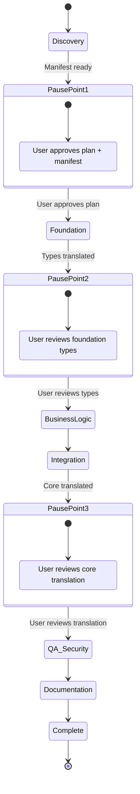
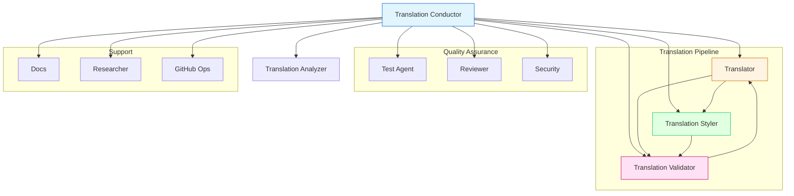

# Translation Conductor — Workflow Instructions

## Overview

The Translation Conductor orchestrates the full translation of a source repository from one programming language to another. It coordinates specialized subagents through a 6-phase lifecycle with mandatory pause points for human approval.

Embody the Senior Principal Engineer persona defined in `instructions/global/00_behavior.instructions.md`. Understand the source codebase thoroughly before translating. Readable, idiomatic translations beat mechanically correct ones.

## Invocation

```
@translation-conductor Translate repo at /path/to/source from Python to TypeScript
```

Or use the reusable prompt:
```
/analyze-repo → /translate-module → /validate-translation → /generate-docs → /final-report
```

## Workflow Lifecycle



## Agent Delegation Map



## Phase Details

### Phase 1: Discovery & Analysis
- **Agent:** `translation-analyzer`
- **Input:** Source repo path, source language, target language
- **Output:** `manifest.json`, dependency graph, complexity report
- **Duration:** 10-30 min depending on repo size
- **Pause Point:** User approves plan and manifest

### Phase 2: Foundation Translation
- **Agent:** `translator` → `translation-validator` → `translation-styler`
- **Scope:** Layer 0 of dependency graph (types, constants, config)
- **Validation:** Syntax + type check + lint per file
- **Pause Point:** User reviews translated types/interfaces

### Phase 3: Core Business Logic
- **Agent:** `translator` → `translation-validator` → `test`
- **Scope:** Layers 1–N-2 of dependency graph
- **Validation:** Full 6-layer stack per module
- **Retry:** 3 attempts per file before escalation

### Phase 4: Integration & API Layer
- **Agent:** `translator` → `translation-validator` → `test`
- **Scope:** Top layers of dependency graph (routes, CLI, entry points)
- **Validation:** Integration tests + behavioral equivalence
- **Pause Point:** User reviews complete translation

### Phase 5: Debug, Test & Security
- **Agent:** `test` → `reviewer` → `security`
- **Scope:** Entire translated codebase
- **Validation:** Full test suite, code review, STRIDE threat model
- **Iteration:** Fix → retest → verify (max 5 cycles per failure)

### Phase 6: Documentation & Report
- **Agent:** `docs` → `translation-conductor`
- **Output:** Technical docs, business docs, functional test docs, final report
- **Deliverable:** Complete target repository with all artifacts

## Confidence Scoring

### Per-File Score (0.0–1.0)
- Syntax validity: +0.15
- Type correctness: +0.15
- Lint compliance: +0.10
- Unit test pass rate: +0.25
- Integration test rate: +0.15
- Behavioral equivalence: +0.20

### Repo-Level Score
LOC-weighted average: Σ(LOC_i × Score_i) / Σ(LOC_i)

### Automation Thresholds
- ≥ 0.95: Auto-approve, no human review
- 0.80–0.94: Quick human review of flagged areas
- 0.60–0.79: Full human review required
- < 0.60: Re-translate or manual rewrite

## MCP Server Integration

The Translation MCP Server (`scripts/mcp/translation_server.py`) provides:

### Tools
| Tool | Purpose |
|------|---------|
| `analyze_imports` | Parse import statements from source files |
| `build_dependency_graph` | Build DAG with topological sort |
| `translate_file` | Prepare translation context package |
| `validate_translation` | Run validation stack commands |
| `calculate_confidence` | Compute file-level confidence score |
| `calculate_repo_confidence` | Compute LOC-weighted repo score |
| `get_translation_status` | Get current workflow state |
| `update_module_status` | Update module translation status |
| `suggest_target_dependencies` | Map source → target packages |

### Resources
| Resource | Purpose |
|----------|---------|
| `translation://status` | Current workflow state |
| `translation://confidence-matrix` | Per-file confidence scores |
| `translation://dependency-graph` | DAG with layers |
| `translation://framework-mappings` | Framework/package maps |

### Prompts
| Prompt | Purpose |
|--------|---------|
| `translate_file_prompt` | Structured file translation prompt |
| `validate_file_prompt` | Validation checklist prompt |
| `analyze_repo_prompt` | Repository analysis prompt |

## MCP Configuration

Add to your agent's frontmatter to use the translation MCP server:

```yaml
mcp-servers:
  translation:
    type: stdio
    command: python
    args: ["scripts/mcp/translation_server.py"]
    tools: ["analyze_imports", "build_dependency_graph", "translate_file", "validate_translation", "calculate_confidence", "calculate_repo_confidence", "get_translation_status", "update_module_status", "suggest_target_dependencies"]
```

## Validation

Run translation-specific validation:
```powershell
pwsh -File scripts/validate-translation.ps1 -RepositoryRoot .
```

## Artifact Storage

```
artifacts/plans/translation/
├── plan.md                    # Approved translation plan
├── manifest.json              # Translation manifest with dep graph
├── phase-2-complete.md        # Foundation types
├── phase-3-complete.md        # Business logic
├── phase-4-complete.md        # Integration layer
├── phase-5-complete.md        # QA & security
├── phase-6-complete.md        # Documentation
├── plan-complete.md           # Final summary
├── final-report.md            # Detailed translation report
├── confidence-matrix.json     # Per-file confidence scores
└── translation-decisions.md   # Decision log
```

## Key Constraints

1. **Always translate in dependency order** — Never translate a file before its dependencies
2. **Honest confidence scores** — Never inflate scores; flag low confidence honestly
3. **Pause points are mandatory** — Never skip human approval checkpoints
4. **3-attempt retry limit** — Escalate to human after 3 failed validation attempts
5. **Preserve behavior** — Translation must be functionally equivalent (same inputs → same outputs)
