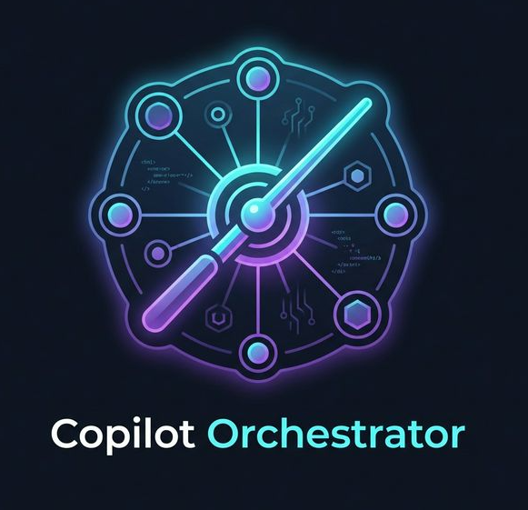

<p align="center">
  
</p>

# Copilot Orchestrator

A multi-agent orchestration system for GitHub Copilot. Provides a structured workflow (conductor → planner → implementer → reviewer → completion) with 16 specialized agents (11 core + 5 translation), reusable skills, and validation tooling.

Use as a shared configuration source across workspaces. Point VS Code at this repo and all projects inherit consistent agent behaviors, tool permissions, and lifecycle guardrails.

## What's Included

| Asset | Count | Location |
|-------|-------|----------|
| Agents | 16 | `.github/agents/` |
| Skills | 12 | `.github/skills/` |
| Prompt templates | 22 | `.github/prompts/` |
| Instruction files | 15 | `instructions/` |
| Validation scripts | 12 | `scripts/` |
| MCP servers | 5 | `scripts/mcp/` |

## Quick Start

### 1. Configure VS Code

Add these settings to your user or workspace `settings.json`:

```json
{
   "chat.useAgentsMdFile": true,
   "chat.useNestedAgentsMdFiles": true,
   "chat.instructionsFilesLocations": ["instructions"],
   "chat.promptFilesLocations": [".github/prompts"],
   "chat.agentFilesLocations": { ".github/agents": true },
   "chat.agentSkillsLocations": { ".github/skills": true },
   "chat.useAgentSkills": true,
   "chat.useClaudeSkills": true,
   "chat.agentCustomizationSkill.enabled": true,
   "chat.customAgentInSubagent.enabled": true,
   "chat.subagents.allowInvocationsFromSubagents": true,
   "github.copilot.chat.searchSubagent.enabled": true,
   "github.copilot.chat.customAgents.showOrganizationAndEnterpriseAgents": true,
   "github.copilot.chat.cli.customAgents.enabled": true,
   "github.copilot.chat.organizationInstructions.enabled": true,
   "chat.thinking.style": "collapsed",
   "chat.agent.thinking.collapsedTools": true,
   "chat.agent.thinking.terminalTools": true,
   "chat.tools.autoExpandFailures": true,
   "chat.askQuestions.enabled": true,
   "github.copilot.chat.anthropic.thinking.budgetTokens": 10000,
   // Note: github.copilot.chat.anthropic.thinking.effort and responsesApiReasoningEffort are deprecated in 1.113.
   // Configure thinking effort via the model picker submenu instead.
   "github.copilot.chat.anthropic.toolSearchTool.enabled": true,
   "github.copilot.chat.anthropic.contextEditing.enabled": true,
   "github.copilot.chat.copilotMemory.enabled": true,
   "github.copilot.chat.advanced.workspace.codeSearchExternalIngest.enabled": true,
   "chat.viewSessions.enabled": true,
   "chat.viewSessions.orientation": "sideBySide",
   "chat.restoreLastPanelSession": false,
   "chat.agentsControl.enabled": true,
   "chat.agentsControl.clickBehavior": "cycle",
   "workbench.startupEditor": "agentSessionsWelcomePage",
   "github.copilot.chat.implementAgent.model": "Claude Sonnet 4.6 (copilot)",
   "chat.tools.terminal.enableAutoApprove": true,
   "chat.tools.terminal.autoApproveWorkspaceNpmScripts": true,
   "chat.tools.terminal.preventShellHistory": true,
   "terminal.integrated.enableKittyKeyboardProtocol": true,
   "workbench.browser.openLocalhostLinks": true,
   "simpleBrowser.useIntegratedBrowser": true,
   "git.worktreeIncludeFiles": [".env.local", "token-thresholds.json"]
}
```

### 2. Validate Installation

```powershell
pwsh -File scripts/validate-copilot-assets.ps1 -RepositoryRoot .
```

### 3. Initialize Artifacts (Optional)

```powershell
pwsh -File scripts/init-artifacts.ps1
```

This creates the local `artifacts/` folder structure for session persistence.

## Other Platforms

The orchestrator works across five platforms. VS Code is native (no setup needed). The others require a one-time setup script.

| Platform | Setup | Guide |
|----------|-------|-------|
| **VS Code** | Built-in — clone and open | [VS Code Configuration](docs/guides/vscode-copilot-configuration.md) |
| **Visual Studio** | `powershell -File scripts/setup-vs-cli.ps1 -Strategy Symlink -TargetPath <project>` | [Visual Studio Onboarding](docs/guides/visual-studio-onboarding.md) |
| **Copilot CLI** | `powershell -File scripts/setup-vs-cli.ps1 -Strategy Symlink -TargetPath <project>` | [Copilot CLI Onboarding](docs/guides/copilot-cli-onboarding.md) |
| **Claude Code** | `powershell -File scripts/setup-claude-code.ps1 -Mode Project -TargetPath <project>` | [Claude Code Onboarding](docs/guides/claude-code-onboarding.md) |
| **Antigravity** | `powershell -File scripts/setup-antigravity.ps1 -Mode Project -TargetPath <project>` | [Antigravity Onboarding](docs/guides/antigravity-onboarding.md) |

macOS/Linux users: use the `.sh` equivalents (`setup-vs-cli.sh`, `setup-claude-code.sh`, `setup-antigravity.sh`). See [Multi-Platform Setup Reference](docs/guides/multi-platform-setup.md) for full details.

## Model Tiers

The orchestrator ships four branches aligned to GitHub Copilot plan pricing. Push to `enterprise` and GitHub Actions automatically syncs the other three.

| Branch | Target Plan | Flagship Model | Use Case |
|--------|-------------|----------------|----------|
| `enterprise` | **Enterprise** | Claude Opus 4.6 (3x) | Source of truth - flagship reasoning on Enterprise-only Opus 4.6 |
| `pro-plus` | **Pro+ / Business** | Claude Opus 4.7 (7.5x) | Flagship reasoning via Opus 4.7 (available on Pro+, Business, Enterprise) |
| `pro` | **Pro / Student** | GPT-5.3-Codex (1x) | No Anthropic premium - routes to GPT-5.3-Codex + GPT-5.4 mini + Haiku 4.5 |
| `free` | **Free** | GPT-5 mini (0x) | Zero premium requests - all agents on GPT-5 mini or GPT-4.1 |

Each agent's `model:` field is a fallback array. VS Code picks the first model you have access to, so the published branches substitute unavailable models with plan-available equivalents.

### How It Works

1. **Develop on `enterprise`** - all agents run Enterprise-tier models with full capability.
2. **Push to `enterprise`** - three GitHub Actions workflows trigger automatically:
   - [`sync-pro-plus-branch.yml`](.github/workflows/sync-pro-plus-branch.yml) resets `pro-plus` from `enterprise` and swaps Opus 4.6 -> Opus 4.7.
   - [`sync-pro-branch.yml`](.github/workflows/sync-pro-branch.yml) resets `pro` from `enterprise` and swaps Anthropic premium/execution + GPT-5.4 to Pro-available models.
   - [`sync-free-branch.yml`](.github/workflows/sync-free-branch.yml) resets `free` from `enterprise` and swaps all paid models to GPT-5 mini / GPT-4.1.
3. **Switch tiers** - clone or checkout the branch matching your plan:
   ```bash
   git checkout pro-plus   # Pro+ / Business
   git checkout pro        # Pro / Student
   git checkout free       # Free
   git checkout enterprise       # Enterprise (source of truth)
   ```

> **Deep dive:** [Branching for Copilot Cost Optimization](docs/guides/branching-for-copilot-cost-optimization.md) - explains the design choices, sync mechanism, and lessons learned.

## Agent Roster

16 specialized agents across three model tiers. Each agent declares a `model:` fallback array and a `thinkingEffort:` hint (low/medium/high). The `pro-plus` / `pro` / `free` branches sync automatically from `enterprise`. See [Model Tiers](#model-tiers) for details.

| Agent | Tier | Default Model (enterprise) | Effort | Purpose |
|-------|------|----------------------|--------|---------|
| Planner | Premium | Claude Opus 4.6 | high | Multi-phase planning |
| Conductor | Execution | Claude Sonnet 4.6 | medium | Lifecycle orchestration |
| Reviewer | Execution | Claude Sonnet 4.6 | high | Multi-mode code review (security mode pins Opus) |
| Implementer | Execution | Claude Sonnet 4.6 | medium | TDD implementation |
| Researcher | Execution | Claude Sonnet 4.6 | high | Evidence gathering |
| Ops | Execution | Claude Sonnet 4.6 | low | Issues, PRs, CI/CD |
| Test | Execution | Claude Sonnet 4.6 | medium | Test authoring |
| IaC | Execution | Claude Sonnet 4.6 | medium | Terraform/Bicep/Pulumi |
| GUI Tester | Execution | Claude Sonnet 4.6 | low | Browser automation |
| Translation Conductor | Execution | Claude Sonnet 4.6 | high | Translation orchestration |
| Translator | Execution | Claude Sonnet 4.6 | medium | File-level translation |
| Translation Analyzer | Execution | Claude Sonnet 4.6 | high | Dependency analysis |
| Translation Validator | Execution | Claude Sonnet 4.6 | high | Validation scoring |
| Docs | Fast | Claude Haiku 4.5 | medium | Documentation |
| UX | Fast | Claude Haiku 4.5 | low | UX/accessibility review |
| Translation Styler | Fast | Claude Haiku 4.5 | medium | Target language idioms |

`thinkingEffort` is the role's baseline reasoning depth — individual prompts can override with the `effort:` frontmatter key.

## Directory Structure

| Path | Purpose |
|------|---------|
| `.github/agents/` | 16 agent definitions |
| `.github/prompts/` | 22 prompt templates |
| `.github/skills/` | 12 agent skills |
| `instructions/` | 15 instruction files (global, workflow, compliance, language) |
| `scripts/` | Validation and tooling (PowerShell 5.1) |
| `scripts/mcp/` | 6 MCP servers |
| `docs/` | Guides, templates, and operational docs |
| `artifacts/` | Local session outputs (plans, reviews, research, security) |

## Validation

```powershell
# Validate all assets
powershell -File scripts/validate-copilot-assets.ps1 -RepositoryRoot .

# Check prompt metadata
powershell -File scripts/add-prompt-metadata.ps1 -RepositoryRoot . -CheckOnly

# Run linting
powershell -File scripts/run-lint.ps1 -RepositoryRoot .

# Run smoke tests
powershell -File scripts/run-smoke-tests.ps1 -RepositoryRoot .

# Token budget report
powershell -File scripts/token-report.ps1 -Path .

# Initialize artifacts folder
powershell -File scripts/init-artifacts.ps1

# Run Pester tests (fast — safe for interactive use)
Invoke-Pester -Path tests -ExcludeTag Slow -Output Detailed
```

## Documentation

| Document | Purpose |
|----------|---------|
| [AGENTS.md](AGENTS.md) | Agent playbook, workflow guardrails, development environment |
| [docs/guides/onboarding.md](docs/guides/onboarding.md) | New contributor guide |
| [docs/guides/model-tiers.md](docs/guides/model-tiers.md) | Model tier strategy, per-agent rationale, cost analysis |
| [docs/guides/central-deployment.md](docs/guides/central-deployment.md) | Org-level deployment with local artifacts |
| [docs/guides/vscode-copilot-configuration.md](docs/guides/vscode-copilot-configuration.md) | VS Code settings reference |
| [docs/guides/background-agents-worktrees.md](docs/guides/background-agents-worktrees.md) | Parallel execution with Git worktrees |
| [docs/guides/claude-skills-migration.md](docs/guides/claude-skills-migration.md) | Migrating prompts to Claude skills |
| [docs/guides/translation-guide.md](docs/guides/translation-guide.md) | Code translation workflow guide |
| [docs/operations.md](docs/operations.md) | Monitoring, metrics, and backlog |
| [docs/CHANGELOG.md](docs/CHANGELOG.md) | Version history |

## License

See [LICENSE](LICENSE) for terms.
