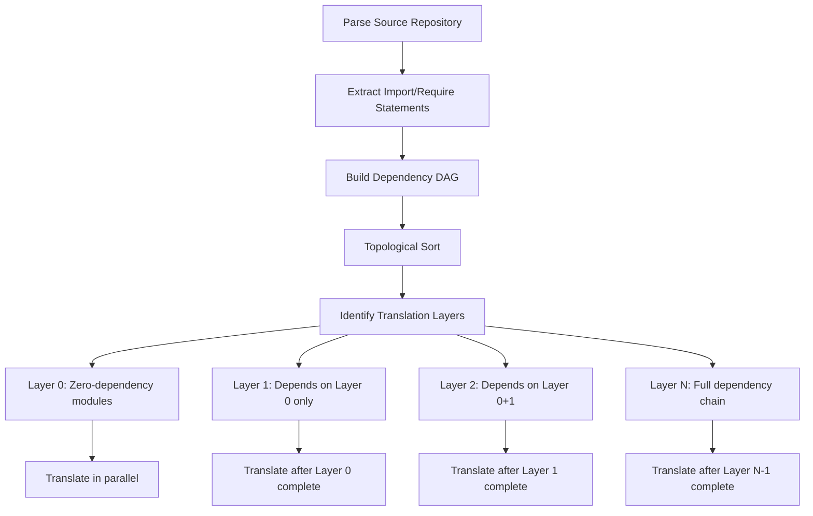

# Research: AI-Assisted Code Translation (Transpilation) of Entire Repositories

**Date**: 2026-02-08T00:00:00Z
**Researcher**: researcher-agent
**Confidence**: High (synthesis of primary sources, production tooling, and academic research)
**Tools Used**: fetch_webpage, read_file, file_search, list_dir

---

## Summary

AI-assisted code translation of large codebases is an emerging but rapidly maturing discipline. The best-known approaches combine LLM-based translation with AST analysis, dependency graph ordering, iterative refinement loops, and formal/functional equivalence verification. Production-grade systems (Amazon Q Code Transformation, GitHub Copilot agent workflows) demonstrate that **agent-orchestrated, phase-gated translation with human-in-the-loop validation** is the most reliable pattern for whole-repository migration. This brief synthesizes academic research, production tooling, and the GitHub Copilot custom agent architecture to recommend a practical, implementable approach.

---

## Sources

| Source | URL | Accessed | Relevance | Method |
|--------|-----|----------|-----------|--------|
| Amazon Q Developer – Code Transformation | https://aws.amazon.com/q/developer/code-transformation/ | 2026-02-08 | High | fetch |
| LLMLift: Verified Code Transpilation with LLMs (Bhatia et al., 2024) | https://arxiv.org/abs/2406.03003 | 2026-02-08 | High | fetch |
| Deep Learning for Code Intelligence Survey (Wan et al., 2023) | https://arxiv.org/abs/2401.00288 | 2026-02-08 | Medium | fetch |
| EXPO: Bridge and Hint for Long-Range Code (Chen et al., 2024) | https://arxiv.org/abs/2405.11233 | 2026-02-08 | Medium | fetch |
| MCP Architecture Overview | https://modelcontextprotocol.io/docs/learn/architecture | 2026-02-08 | High | fetch |
| MCP Tools Specification | https://modelcontextprotocol.io/docs/concepts/tools | 2026-02-08 | High | fetch |
| MCP Resources Specification | https://modelcontextprotocol.io/docs/concepts/resources | 2026-02-08 | High | fetch |
| GitHub Blog: Copilot IDE Best Practices (Kerr, 2024) | https://github.blog/ai-and-ml/github-copilot/how-to-use-github-copilot-in-your-ide-tips-tricks-and-best-practices/ | 2026-02-08 | High | fetch |
| Copilot Orchestrator Repository (local workspace) | Local `.github/` directory structure | 2026-02-08 | High | read_file |

---

## 1. State of the Art in LLM-based Code Translation

### 1.1 How Current LLMs Handle Code Translation

**GitHub Copilot / Claude / GPT-family models** handle code translation primarily through:

- **Prompt-driven translation**: The user provides source code and specifies the target language. The LLM generates equivalent code based on its training corpus of multi-language code.
- **Context-window constrained**: All current LLMs are limited by context windows (128K–200K tokens for frontier models). A single file of ~5,000 lines of code can consume 15K–30K tokens, meaning whole-repository translation must be chunked.
- **Pattern matching over formal reasoning**: LLMs excel at syntactic translation (e.g., Python → TypeScript type annotations) but struggle with semantic equivalence for complex business logic, concurrency patterns, and platform-specific idioms.

**Amazon Q Code Transformation** (production-grade) demonstrates the most mature approach:
- Automates Java 8/11 → Java 17 upgrades and .NET Framework → cross-platform .NET porting
- Uses agent-based discovery, planning, and execution phases
- Amazon reports 30,000+ internal production applications migrated, saving "years of development work" and "$260M in annual cost savings"
- Customer testimonial (Novacomp): 10,000+ LOC Java 8 → Java 17 migration completed "in minutes" vs. two weeks manually

**Key insight**: Amazon Q does NOT do arbitrary language-to-language translation. It focuses on **version upgrades within the same language ecosystem**, which is a fundamentally easier problem than cross-language translation.

### 1.2 Best Strategies for Translating Large Codebases

| Strategy | Description | Best For | Limitations |
|----------|-------------|----------|-------------|
| **File-by-File** | Translate each source file independently | Loosely coupled codebases, utility libraries | Breaks cross-file references; misses shared types/interfaces |
| **Module-by-Module** | Translate entire modules/packages as units | Modular architectures, microservices | Requires understanding module boundaries; larger context needed |
| **AST-Guided** | Parse source into AST, translate node-by-node with LLM assistance | Strongly typed languages, DSL migrations | Requires language-specific parsers; brittle for dynamic languages |
| **Dependency-Ordered** | Build dependency graph, translate leaf nodes first | Libraries with clear hierarchies | Complex for circular dependencies; requires tooling |
| **Hybrid (Recommended)** | Combine AST analysis for structure + LLM for semantic translation + dependency ordering | Enterprise codebases | Highest implementation complexity |

**Recommended approach: Dependency-Ordered Module Translation**

1. **Phase 1 — Discovery**: Parse the repository to identify all files, modules, and their dependencies
2. **Phase 2 — Dependency Graph**: Build a directed acyclic graph (DAG) of module dependencies
3. **Phase 3 — Leaf-First Translation**: Translate modules with no dependencies first (types, constants, utilities)
4. **Phase 4 — Incremental Ascent**: Translate modules that depend only on already-translated modules
5. **Phase 5 — Integration**: Wire translated modules together, resolve import paths

### 1.3 Common Pitfalls and Failure Modes

| Failure Mode | Description | Mitigation |
|-------------|-------------|------------|
| **Semantic drift** | Translated code compiles but has subtly different behavior | Functional equivalence tests; property-based testing |
| **Idiom mismatch** | Direct syntax translation produces non-idiomatic target code | Post-translation idiom review pass; style-guide enforcement |
| **Type system gaps** | Source language has features with no direct target equivalent (e.g., Python duck typing → TypeScript) | Manual type annotation pass; generate `.d.ts` stubs first |
| **Dependency resolution** | Source dependencies don't exist in target ecosystem | Pre-translation dependency mapping; identify equivalent packages |
| **Context overflow** | Large files exceed LLM context windows | Chunk by class/function; maintain cross-chunk type context |
| **Hallucinated APIs** | LLM invents non-existent APIs in target language | API validation pass; type-check translated code immediately |
| **Concurrency model mismatch** | Threading/async patterns differ between languages | Manual review of concurrency code; dedicated translation rules |
| **Build system divergence** | Build/package configs not translated (Makefile → package.json) | Dedicated build-system translation phase |

### 1.4 Confidence Scoring and Validation

**Per-file confidence scoring model:**

```
confidence_score = weighted_average(
    syntax_validity     * 0.20,  # Does it parse/compile?
    type_check_pass     * 0.20,  # Does it type-check?
    test_pass_rate      * 0.30,  # What % of tests pass?
    idiom_score         * 0.15,  # Is it idiomatic? (LLM-judged)
    coverage_delta      * 0.15   # Coverage vs. source
)
```

Confidence tiers:
- **HIGH (0.85–1.0)**: Compiles, passes all tests, idiomatic
- **MEDIUM (0.60–0.84)**: Compiles, some test failures, minor idiom issues
- **LOW (0.30–0.59)**: Compiles with warnings, significant test failures
- **CRITICAL (<0.30)**: Does not compile or semantically broken

---

## 2. Orchestration Patterns for Large-Scale Translation

### 2.1 Breaking a Repository into Translation Units

The optimal decomposition strategy depends on repository architecture:

```
Repository
├── Translation Unit 0: Type definitions, interfaces, enums
├── Translation Unit 1: Constants, configuration
├── Translation Unit 2: Utility / helper modules
├── Translation Unit 3: Data models / entities
├── Translation Unit 4: Service / business logic layer
├── Translation Unit 5: Controller / API layer
├── Translation Unit 6: Tests (translated AFTER source)
├── Translation Unit 7: Build configuration / package manifest
└── Translation Unit 8: Documentation / README
```

**Rules for decomposition:**
- Each translation unit should fit within a single LLM context window (ideally <50K tokens including prompt)
- Units should have minimal forward references (depend only on already-translated units)
- Shared types/interfaces should be in their own unit and translated FIRST
- Tests are a separate translation unit, translated after the code they test

### 2.2 Dependency Graph Analysis for Translation Ordering



**Algorithm:**
1. Parse all source files, extract import/require/include statements
2. Build adjacency list of file-to-file dependencies
3. Detect and break circular dependencies (flag for manual review)
4. Topologically sort the dependency graph
5. Group nodes by depth level → these are parallelizable "translation layers"
6. Execute translation layer-by-layer, validating each before proceeding

### 2.3 Handling Cross-File References

| Challenge | Solution |
|-----------|----------|
| **Import path rewriting** | Maintain a source→target path mapping table; rewrite imports after translation |
| **Shared types** | Translate types/interfaces first; provide as context to all subsequent translations |
| **Module system differences** | Map source module system to target (e.g., Python packages → TypeScript/ESM modules) |
| **Re-exports / barrel files** | Generate index/barrel files after all module translations complete |
| **Global state** | Identify global state patterns; translate to target-idiomatic patterns (singletons, context) |
| **Circular dependencies** | Break cycles by extracting shared interfaces into a new module |

### 2.4 Iterative Refinement and Feedback Loops

The **translate → validate → fix → re-validate** loop is critical:

```
┌──────────────────────────────────────────────┐
│                                              │
│  ┌──────────┐    ┌──────────┐    ┌────────┐  │
│  │ Translate │───>│ Validate │───>│  Fix   │──┤
│  └──────────┘    └──────────┘    └────────┘  │
│       ▲                ▲              │      │
│       │                │              │      │
│       │           test failures       │      │
│       │           lint errors         │      │
│       │           type errors         ▼      │
│       │          ┌──────────────────────┐    │
│       └──────────│ Re-translate chunk  │    │
│                  └──────────────────────┘    │
│                                              │
│  Max iterations: 3 per chunk                 │
│  Escalate to human if confidence < 0.6       │
└──────────────────────────────────────────────┘
```

**Recommended iteration limits:**
- **3 automated retry attempts** per translation unit
- After 3 failures, **escalate to human review** with diagnostic report
- Track which patterns consistently fail → build pattern-specific translation rules

---

## 3. Validation and Quality Assurance

### 3.1 Multi-Layer Validation Strategy

| Layer | What | How | When |
|-------|------|-----|------|
| **L0: Syntax** | Does the translated code parse? | Language parser / compiler | Immediately after translation |
| **L1: Type Check** | Does it pass type checking? | `tsc --noEmit`, `mypy`, etc. | After L0 passes |
| **L2: Lint** | Is it style-compliant? | ESLint, Prettier, Black, etc. | After L1 passes |
| **L3: Unit Tests** | Do translated tests pass? | Test framework execution | After L2 passes |
| **L4: Integration** | Do modules work together? | Integration test suite | After all modules translated |
| **L5: Behavioral** | Is behavior equivalent to source? | Differential testing / golden tests | After L4 passes |
| **L6: Idiom Review** | Is the code idiomatic? | LLM review + human review | Final gate |

### 3.2 Equivalence Checking Between Source and Target

**Approaches ranked by rigor:**

1. **Formal verification** (LLMLift approach — Bhatia et al., 2024): Generate mathematical proofs of functional equivalence. Highest confidence but limited to certain language pairs and DSLs. LLMLift uses LLMs to both translate code AND generate equivalence proofs.

2. **Differential testing**: Run identical inputs through both source and target code, compare outputs. Practical for functions with deterministic behavior.

3. **Property-based testing**: Generate random inputs, verify that source and target produce equivalent outputs for all generated cases. Catches edge cases that unit tests miss.

4. **Golden file testing**: Capture source program outputs for a comprehensive test suite, use as correctness oracle for target code.

5. **Test translation + execution**: Translate the source test suite to the target language, execute it against translated code. Most practical for large codebases.

### 3.3 Coverage Metrics and Confidence Ratings

**Translation coverage dashboard:**

```
┌─────────────────────────────────────────────────────┐
│ Repository Translation Progress                      │
├──────────────────────────┬──────┬──────┬────────────┤
│ Category                 │ Done │ Total│ Confidence │
├──────────────────────────┼──────┼──────┼────────────┤
│ Type definitions         │  12  │  12  │  HIGH      │
│ Utility modules          │   8  │  10  │  MEDIUM    │
│ Data models              │   5  │   7  │  HIGH      │
│ Service layer            │   3  │  12  │  LOW       │
│ API controllers          │   0  │   8  │  —         │
│ Tests                    │   2  │  25  │  MEDIUM    │
│ Build config             │   1  │   1  │  HIGH      │
├──────────────────────────┼──────┼──────┼────────────┤
│ TOTAL                    │  31  │  75  │  MEDIUM    │
└──────────────────────────┴──────┴──────┴────────────┘
```

### 3.4 Automated Debugging Cycles

When translated code fails validation:

1. **Capture error context**: Collect compiler errors, test failures, stack traces
2. **Provide to LLM with source context**: "Here is the original source, the translated code, and the error. Fix the translation."
3. **Apply targeted fix**: LLM generates a patch for the specific failure
4. **Re-validate**: Run the failed validation layer again
5. **Track fix patterns**: Build a knowledge base of common translation errors and fixes
6. **Escalate persistent failures**: After 3 fix attempts, mark for human review with all context

---

## 4. MCP Server Approaches for Code Translation

### 4.1 Why MCP for Code Translation

The Model Context Protocol (MCP) provides a standardized interface for AI applications to access tools, resources, and prompts from external systems. For code translation, MCP servers can:

- **Maintain translation state** across multiple LLM interactions (which files are translated, their confidence scores, dependency graph status)
- **Expose specialized tools** for parsing, validating, and testing translated code
- **Provide resources** that keep translation context available (type mappings, API equivalence tables, dependency graphs)
- **Enable dynamic tool discovery** so the translation agent can discover new capabilities as needed

### 4.2 Proposed MCP Server Architecture for Translation

```
┌─────────────────────────────────────────────────────┐
│           Translation MCP Server                     │
├─────────────────────────────────────────────────────┤
│                                                      │
│  TOOLS:                                              │
│  ┌─────────────────────────────────────────────┐    │
│  │ parse_source_file(path, language)            │    │
│  │   → Returns AST, imports, exports, types     │    │
│  │                                               │    │
│  │ build_dependency_graph(repo_path)             │    │
│  │   → Returns DAG of module dependencies       │    │
│  │                                               │    │
│  │ translate_file(source_path, target_lang,      │    │
│  │               context_files[])                │    │
│  │   → Returns translated code + confidence     │    │
│  │                                               │    │
│  │ validate_translation(translated_path,         │    │
│  │                      validation_level)        │    │
│  │   → Returns pass/fail + error details        │    │
│  │                                               │    │
│  │ run_equivalence_test(source_path,             │    │
│  │                      target_path, test_type)  │    │
│  │   → Returns equivalence score + failures     │    │
│  │                                               │    │
│  │ get_translation_status()                      │    │
│  │   → Returns progress dashboard               │    │
│  │                                               │    │
│  │ rewrite_imports(file_path, mapping_table)     │    │
│  │   → Returns file with rewritten imports      │    │
│  │                                               │    │
│  │ suggest_target_dependencies(source_deps[])    │    │
│  │   → Returns equivalent packages in target    │    │
│  └─────────────────────────────────────────────┘    │
│                                                      │
│  RESOURCES:                                          │
│  ┌─────────────────────────────────────────────┐    │
│  │ translation://status                         │    │
│  │   → Overall translation progress and state   │    │
│  │                                               │    │
│  │ translation://dependency-graph                │    │
│  │   → Current dependency DAG (JSON)            │    │
│  │                                               │    │
│  │ translation://type-mappings                   │    │
│  │   → Source→target type mapping table         │    │
│  │                                               │    │
│  │ translation://api-mappings                    │    │
│  │   → Source→target API equivalences           │    │
│  │                                               │    │
│  │ translation://file/{path}                     │    │
│  │   → Translation state for a specific file    │    │
│  │                                               │    │
│  │ translation://errors                          │    │
│  │   → Current validation errors & failures     │    │
│  └─────────────────────────────────────────────┘    │
│                                                      │
│  PROMPTS:                                            │
│  ┌─────────────────────────────────────────────┐    │
│  │ translate-file                               │    │
│  │   → Structured prompt for file translation   │    │
│  │                                               │    │
│  │ fix-translation-error                         │    │
│  │   → Prompt with error context for debugging  │    │
│  │                                               │    │
│  │ review-translation-idioms                     │    │
│  │   → Prompt for idiom review of translated    │    │
│  │     code in target language style             │    │
│  └─────────────────────────────────────────────┘    │
│                                                      │
│  NOTIFICATIONS:                                      │
│  ┌─────────────────────────────────────────────┐    │
│  │ tools/list_changed                           │    │
│  │   → When new validation tools become ready   │    │
│  │                                               │    │
│  │ resources/updated                             │    │
│  │   → When translation status changes          │    │
│  └─────────────────────────────────────────────┘    │
│                                                      │
└─────────────────────────────────────────────────────┘
```

### 4.3 MCP Server Implementation Recommendations

1. **Use Tasks (experimental)** for long-running translation operations. The MCP Tasks primitive supports durable execution wrappers for expensive computations — ideal for multi-file translation jobs.

2. **Leverage Resource Subscriptions** so the translation orchestrator can subscribe to `translation://status` and get real-time updates as files are translated and validated.

3. **Implement Sampling** to allow the MCP server to request LLM completions from the host AI application. This enables the server to orchestrate translation internally while staying model-independent.

4. **Use Elicitation** to request human input when the server encounters ambiguous translation decisions (e.g., "This Python `dict` could be translated as TypeScript `Record<string, any>` or a typed interface. Which do you prefer?").

---

## 5. Documentation Generation Alongside Translation

### 5.1 Documentation Types

| Document Type | Purpose | When Generated |
|--------------|---------|----------------|
| **Translation Manifest** | Maps every source file to its target equivalent, with status and confidence | Continuously updated during translation |
| **API Migration Guide** | Documents breaking changes between source and target APIs | After service layer translation |
| **Type Mapping Reference** | Comprehensive source→target type equivalence table | After type definitions translated |
| **Dependency Mapping** | Source dependencies → target equivalents with version notes | During dependency analysis phase |
| **Behavioral Equivalence Report** | Test results proving source/target behavior matches | After all tests pass |
| **Known Limitations** | Documents untranslated features, manual intervention areas | Throughout; finalized at completion |
| **Developer Onboarding Guide** | How to work with the translated codebase | After completion |

### 5.2 Business vs. Technical Documentation

**Business documentation** (for stakeholders):
- Translation progress dashboard with percentages and timelines
- Risk register with mitigation strategies
- Cost analysis (time saved vs. manual translation)
- Functional equivalence certification

**Technical documentation** (for developers):
- File-by-file translation notes with decision rationale
- Architecture mapping (source architecture → target architecture)
- Idiom translation guide (source patterns → target patterns)
- Known divergences and workarounds
- Build and deployment changes

### 5.3 Functional Test Documentation Pattern

For each translated module, generate:

```markdown
## Module: {module_name}

### Source
- **Language**: {source_language}
- **Path**: `{source_path}`
- **Functions**: {count}
- **Lines**: {loc}

### Translation
- **Target Language**: {target_language}
- **Target Path**: `{target_path}`
- **Confidence**: {score} ({tier})
- **Translator**: {agent/human}

### Functional Equivalence Tests
| Test Case | Input | Source Output | Target Output | Match |
|-----------|-------|-------------|---------------|-------|
| {test_1}  | ...   | ...         | ...           | ✅/❌ |
| {test_2}  | ...   | ...         | ...           | ✅/❌ |

### Known Divergences
- {divergence_1}: {explanation and rationale}

### Manual Review Required
- [ ] {item requiring human verification}
```

---

## 6. Best Practices for GitHub Copilot in VS Code

### 6.1 Agent Architecture for Translation Workflows

Building on the existing copilot_orchestrator architecture, a code translation workflow would use:

**New agents to create:**

```
.github/agents/
├── translator.agent.md      # Primary translation orchestrator
├── parser.agent.md           # Source code analysis and AST parsing
└── equivalence.agent.md      # Equivalence checking and validation
```

**Existing agents to leverage:**
- **Conductor** — Overall lifecycle orchestration with pause points
- **Planner** — Create the multi-phase translation plan
- **Implementer** — Execute file translations
- **Reviewer** — Review translated code quality
- **Test** — Write and validate equivalence tests
- **Docs** — Generate translation documentation
- **Security** — Review translated code for security regressions

**New skills to create:**

```
.github/skills/
├── code-translation/
│   └── SKILL.md              # Translation patterns, type mappings, idiom guides
├── dependency-analysis/
│   └── SKILL.md              # Dependency graph construction and ordering
└── equivalence-testing/
    └── SKILL.md              # Functional equivalence validation patterns
```

### 6.2 Recommended Conductor Workflow for Translation

```
Phase 0: Discovery & Analysis
  → Researcher: Analyze source repository structure
  → Parser: Build dependency graph
  → Planner: Create translation plan with ordering
  🛑 PAUSE POINT: Human approves translation plan

Phase 1: Foundation Translation
  → Translator: Translate type definitions, interfaces, enums
  → Test: Validate type compatibility
  → Reviewer: Review translated types
  🛑 PAUSE POINT: Human verifies type mappings

Phase 2: Utilities & Helpers
  → Translator: Translate utility modules (leaf dependencies)
  → Test: Run unit tests on translated utilities
  → Reviewer: Review for idiom compliance
  🛑 PAUSE POINT: Human spot-checks utilities

Phase 3: Data Models & Services
  → Translator: Translate data models and service layer
  → Test: Run translated tests against translated code
  → Equivalence: Run differential testing
  → Reviewer: Full review cycle
  🛑 PAUSE POINT: Human reviews business logic translation

Phase 4: API Layer & Integration
  → Translator: Translate controllers and API endpoints
  → Test: Run integration tests
  → Security: Review for security regressions
  → Reviewer: Final review
  🛑 PAUSE POINT: Human approves integration

Phase 5: Build & Configuration
  → Translator: Translate build configs, CI/CD, Docker
  → Deployment: Verify deployment configuration
  🛑 PAUSE POINT: Human verifies build system

Phase 6: Documentation & Completion
  → Docs: Generate all translation documentation
  → Equivalence: Final behavioral equivalence report
  → Conductor: Create plan-complete.md
  🛑 PAUSE POINT: Final sign-off
```

### 6.3 Maximizing Agent Autonomy with Pause Points

**When to pause (mandatory):**
- After translation plan creation (Phase 0)
- After type/interface translation (foundational correctness)
- After business logic translation (semantic correctness)
- Before final deployment configuration

**When to let agents run autonomously:**
- Utility/helper file translation (low risk)
- Test translation and execution
- Lint/style fixing
- Documentation generation
- Import path rewriting

**Session management for long-running translation:**
- Use **one conductor session per translation phase** to prevent context overflow
- Set `chat.restoreLastPanelSession: false` to prevent context leakage
- Persist translation state in `artifacts/` folder between sessions:

```
artifacts/
├── translation/
│   ├── manifest.json           # Source→target file mapping + status
│   ├── dependency-graph.json   # DAG of module dependencies
│   ├── type-mappings.json      # Source→target type equivalences
│   ├── api-mappings.json       # Source→target API equivalences
│   ├── confidence-scores.json  # Per-file confidence ratings
│   ├── error-log.json          # Persistent error tracking
│   └── phases/
│       ├── phase-0-discovery.md
│       ├── phase-1-types.md
│       ├── phase-2-utilities.md
│       └── ...
```

### 6.4 Custom Instructions for Translation

Create these instruction files:

```
instructions/
├── workflows/
│   └── translation.instructions.md    # Translation-specific workflow rules
├── languages/
│   ├── python-to-typescript.instructions.md
│   ├── java-to-kotlin.instructions.md
│   └── csharp-to-typescript.instructions.md
└── compliance/
    └── translation-qa.instructions.md  # QA requirements for translations
```

**Key instruction content:**
- Never translate comments literally — adapt to target language documentation conventions
- Always preserve function signatures with equivalent types
- Map source error handling patterns to target-idiomatic equivalents
- Include original source path as a comment in each translated file
- Generate TypeDoc/JSDoc/docstring from source documentation
- Flag any non-deterministic behavior for manual review

### 6.5 Prompt Templates for Translation

```
.github/prompts/
├── translation/
│   ├── analyze-source.prompt.md       # Analyze source file for translation
│   ├── translate-file.prompt.md       # Translate a single file
│   ├── fix-translation.prompt.md      # Fix a failed translation
│   ├── review-idioms.prompt.md        # Review for idiomatic target code
│   ├── generate-equivalence-test.prompt.md  # Create equivalence tests
│   └── map-dependencies.prompt.md     # Map source deps to target
```

---

## 7. Recommended Implementation Architecture

### 7.1 System Architecture

```
┌─────────────────────────────────────────────────────────────┐
│                    GitHub Copilot (VS Code)                   │
│                                                               │
│  ┌─────────────┐  ┌─────────────┐  ┌─────────────────────┐  │
│  │  Conductor   │  │  Translator  │  │  Equivalence Agent  │  │
│  │   Agent      │──│   Agent      │──│                     │  │
│  └──────┬───────┘  └──────┬───────┘  └──────────┬──────────┘  │
│         │                 │                      │             │
│  ┌──────┴─────────────────┴──────────────────────┴──────────┐ │
│  │                    MCP Client                             │ │
│  └──────────────────────────┬────────────────────────────────┘ │
│                             │                                  │
└─────────────────────────────┼──────────────────────────────────┘
                              │ JSON-RPC 2.0
                              │
┌─────────────────────────────┼──────────────────────────────────┐
│                    Translation MCP Server                       │
│                                                                 │
│  ┌───────────────┐  ┌────────────────┐  ┌──────────────────┐   │
│  │ Source Parser  │  │  Dep. Analyzer │  │  Validator        │   │
│  │ (tree-sitter)  │  │  (import graph)│  │  (compiler/test) │   │
│  └───────────────┘  └────────────────┘  └──────────────────┘   │
│                                                                 │
│  ┌───────────────────────────────────────────────────────────┐  │
│  │                 Translation State Store                    │  │
│  │  (manifest, dependency graph, type mappings, confidence)  │  │
│  └───────────────────────────────────────────────────────────┘  │
│                                                                 │
└─────────────────────────────────────────────────────────────────┘
```

### 7.2 Key Technology Choices

| Component | Recommended Technology | Rationale |
|-----------|----------------------|-----------|
| Source parsing | tree-sitter | Multi-language, fast, produces concrete syntax trees |
| Dependency analysis | Custom script per language | Import patterns are language-specific |
| Type checking | Target language compiler | Most authoritative validation |
| Test execution | Target language test framework | Native test running |
| State persistence | JSON files in `artifacts/` | Simple, version-controllable, human-readable |
| MCP server runtime | Python or TypeScript | Best SDK support for MCP |

---

## Contradictions / Gaps

1. **Academic vs. Production gap**: Most academic research (LLMLift, EXPO) focuses on function-level or small-program translation. No published peer-reviewed work validates whole-repository translation of production codebases ≥100K LOC with LLMs. Amazon Q is the closest but only handles intra-language version upgrades.

2. **Formal verification scalability**: LLMLift's verified transpilation approach (generating proofs of equivalence) works for DSLs and small programs but has not been demonstrated at repository scale.

3. **Cross-language translation maturity**: While Amazon Q reports impressive results for Java upgrades and .NET porting, these are **within-ecosystem** translations. Cross-language translation (e.g., Python → Rust, C# → TypeScript) remains significantly harder and less reliable.

4. **Context window limitations**: Even 200K token context windows cannot hold entire repositories. The state management and chunking strategies described above are essential but add significant orchestration complexity.

5. **LLM accuracy concerns**: Research (Kabir et al., 2023) found that 52% of ChatGPT answers to programming questions contain incorrect information. This error rate would be unacceptable for production code translation without rigorous validation layers.

---

## Recommendations

### Immediate Actions

1. **Create a `translator.agent.md`** in the copilot_orchestrator that extends the conductor pattern for code translation workflows
2. **Build a `code-translation` skill** with language-pair-specific translation rules, type mappings, and idiom guides
3. **Develop translation-specific prompts** for file analysis, translation, and equivalence testing
4. **Create translation workflow instructions** (`translation.instructions.md`) with the phase-gated approach described above

### Medium-Term

5. **Build a Translation MCP Server** (Python or TypeScript) that exposes the tools and resources described in Section 4
6. **Implement a dependency graph analyzer** that works for the most common source languages (Python, JavaScript/TypeScript, Java, C#)
7. **Create a translation dashboard** (JSON-based) that tracks progress, confidence, and validation status

### Long-Term

8. **Develop formal equivalence testing** using property-based testing frameworks
9. **Build a translation pattern library** documenting successful idiom translations for common language pairs
10. **Contribute best practices** back to the GitHub awesome-copilot repository

### Risk Mitigations

| Risk | Probability | Impact | Mitigation |
|------|-------------|--------|------------|
| LLM produces incorrect translations | High | Critical | Multi-layer validation (compile → type-check → test → review) |
| Context overflow on large files | Medium | High | Chunk by class/function; maintain type context separately |
| Circular dependencies block ordering | Medium | Medium | Detect cycles; extract shared interfaces; flag for human review |
| No equivalent target dependency | Medium | High | Pre-translation dependency audit; identify before starting |
| Translation drift over long sessions | High | Medium | Persist state in artifacts; use fresh sessions per phase |
| Build system translation failures | Medium | Medium | Dedicated build-system translation phase with manual review |

---

## Open Questions

- [ ] What specific source→target language pairs are the highest priority? This significantly affects the skill and instruction content.
- [ ] Is there an existing test suite for the source repository? The presence or absence of tests dramatically changes the validation strategy.
- [ ] What is the acceptable confidence threshold for autonomous translation vs. human review?
- [ ] Should the translation preserve the exact source architecture, or is architectural refactoring acceptable during migration?
- [ ] What is the target deployment environment? This affects build system and dependency translation.
- [ ] Are there compliance requirements (SOC2, HIPAA, GDPR) that affect how translated code must be validated?

---

## TODO

```
- [x] Research LLM code translation state of the art
- [x] Research Amazon Q Code Transformation approach
- [x] Analyze MCP architecture for translation use cases
- [x] Review copilot_orchestrator agent architecture
- [x] Research verified transpilation (LLMLift)
- [x] Document dependency graph ordering strategies
- [x] Design MCP server tool/resource schema
- [x] Map GitHub Copilot agent/skill/instruction patterns
- [x] Document validation and confidence scoring approaches
- [x] Compile recommendations and open questions
- [ ] (Follow-up) Build translator.agent.md prototype
- [ ] (Follow-up) Build code-translation skill
- [ ] (Follow-up) Prototype Translation MCP Server
- [ ] (Follow-up) Create language-pair-specific instruction files
```
