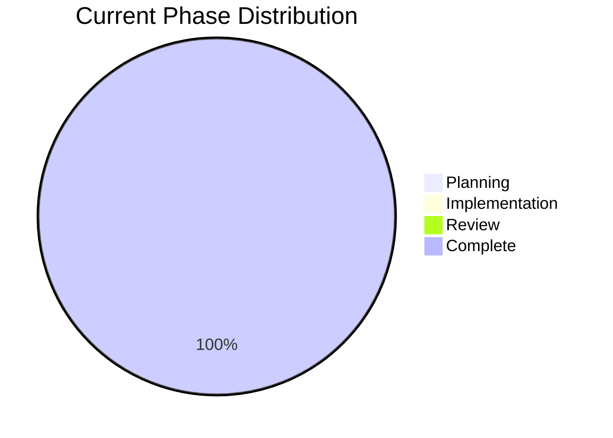

# Workflow Metrics Dashboard

**Report Period:** 2025-10-08 to 2025-11-07
**Generated:** 2025-11-07 23:03:50

---

## Session Overview

| Metric | Count | Percentage |
|--------|-------|------------|
| Total Sessions | 2 | 100% |
| Completed | 1 | 50% |
| Failed | 0 | 0% |
| In Progress | 0 | 0% |

---

## Phase Distribution

---

## Escalation Analysis

| Tier | Count | Rate per 10 Sessions |
|------|-------|---------------------|
| Tier 1 (Automatic) | 0 | 0 |
| Tier 2 (Recommended) | 1 | 5 |
| Tier 3 (Optional) | 0 | 0 |
| **Total** | **1** | **5** |

---

## Model Usage & Cost

| Metric | Value |
|--------|-------|
| Premium Model Calls | 2 |
| Efficient Model Calls | 1 |
| Total Calls | 3 |
| Premium Usage % | 66.7% |
| **Target Premium Usage** | **20%** |
| Estimated Total Cost | $0.47 |

**Status:** ⚠️ Above target (>25%)

---

## Quality Metrics

| Metric | Count | Percentage |
|--------|-------|------------|
| Total Reviews | 2 | 100% |
| Approved | 1 | 50% |
| Needs Revision | 1 | 50% |
| Failed | 0 | 0% |

**Target:** ≥90% approval rate  
**Status:** ⚠️ Below target

---

## Insights & Recommendations

### Escalation Patterns
- Escalation rate is healthy

### Cost Efficiency
- Consider reviewing escalation triggers - premium usage high

### Quality Trends
- Review processes may need enhancement

### Next Actions
- Review INSTRUCTION_CHANGELOG.md for recent instruction changes
- Check docs/operations.md for planned improvements
- Monitor trends over next reporting period

---

**Dashboard Status:** Active  
**Next Update:** Run `scripts/analyze-sessions.ps1` as needed  
**Data Source:** `./plans/sessions`
