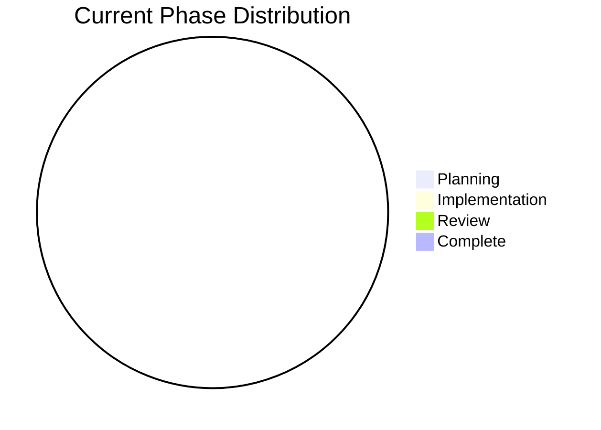

# Workflow Metrics Dashboard

**Report Period:** 2025-10-19 to 2025-11-18
**Generated:** 2025-11-18 18:49:19

---

## Session Overview

| Metric | Count | Percentage |
|--------|-------|------------|
| Total Sessions | 0 | 100% |
| Completed | 0 | 0% |
| Failed | 0 | 0% |
| In Progress | 0 | 0% |

---

## Phase Distribution

```mermaid
pie title Current Phase Distribution
    "Planning" : 0
    "Implementation" : 0
    "Review" : 0
    "Complete" : 0
```

---

## Escalation Analysis

| Tier | Count | Rate per 10 Sessions |
|------|-------|---------------------|
| Tier 1 (Automatic) | 0 | 0 |
| Tier 2 (Recommended) | 0 | 0 |
| Tier 3 (Optional) | 0 | 0 |
| **Total** | **0** | **0** |

---

## Model Usage & Cost

| Metric | Value |
|--------|-------|
| Premium Model Calls | 0 |
| Efficient Model Calls | 0 |
| Total Calls | 0 |
| Premium Usage % | 0% |
| **Target Premium Usage** | **20%** |
| Estimated Total Cost | $0.00 |

**Status:** ⚠️ Above target (>25%)

---

## Quality Metrics

| Metric | Count | Percentage |
|--------|-------|------------|
| Total Reviews | 0 | 100% |
| Approved | 0 | 0% |
| Needs Revision | 0 | 0% |
| Failed | 0 | 0% |

**Target:** ≥90% approval rate
**Status:** ℹ️ No data

---

## DS-Star Workflow Metrics

| Metric | Value |
|--------|-------|
| Sessions Analyzed | 2 |
| Completion Rate | 100% |
| Avg Rounds | 1.5 |
| Avg Duration (min) | 219.4 |
| Avg Steps per Session | 6 |
| In Progress | 0 |
| Resume-Ready In-Progress Sessions | 0 (0%) |

### Verdict Mix

| Verdict | Count |
|---------|-------|
| SUFFICIENT | 2 |
| INSUFFICIENT | 0 |
| BLOCKED | 0 |

### Latest Session Highlights
- `20251118_churn_q4` - COMPLETED (Rounds: 1, Verdict: SUFFICIENT, Duration: 420.0 min)
- `20251115_094200_dsstar` - completed (Rounds: 2, Verdict: SUFFICIENT, Duration: 18.7 min)

### Performance Baselines (Initial)
Based on fixture validation and pilot sessions:
- **Target Duration:** < 20 minutes for standard 2-round analysis
- **Target Rounds:** < 3 rounds per query
- **Target Verdict Mix:** > 80% SUFFICIENT on first review

_Data source:_ `C:\Users\Micha\OneDrive\Documents\Projects\copilot_orchestrator\plans\data-analysis`

---

## Insights & Recommendations

**No session data available for this period.**

To start collecting analytics:
1. Ensure session metadata is being written to `./plans/sessions`
2. Follow the session metadata schema (see docs/templates/)
3. Run this script again after sessions complete

---

**Dashboard Status:** Active
**Next Update:** Run `scripts/analyze-sessions.ps1` as needed
**Data Source:** `./plans/sessions`
