# Mermaid Diagram Patterns

This guide provides reusable Mermaid diagram patterns for use in planning documents. Include diagrams when they clarify architecture, workflows, state transitions, or data flows beyond what prose can convey.

## When to Include Diagrams

**Required for:**
- Architecture changes affecting multiple components
- Multi-phase workflows with parallel or conditional paths
- State machines with complex transitions
- Data pipelines with transformations

**Optional for:**
- Simple linear workflows
- Single-component changes
- Minor refactorings

**Never for:**
- Trivial bug fixes
- Documentation-only updates

---

## Architecture Diagrams

### Component Architecture

Use flowcharts to show system components and their relationships:

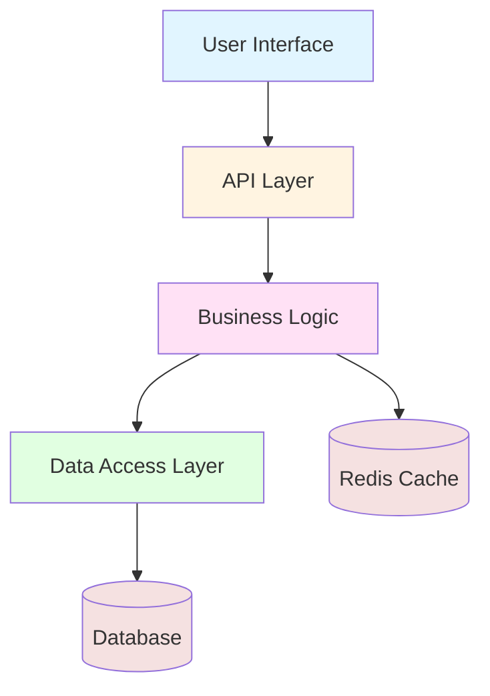

### Layered Architecture

Show architectural layers and cross-cutting concerns:

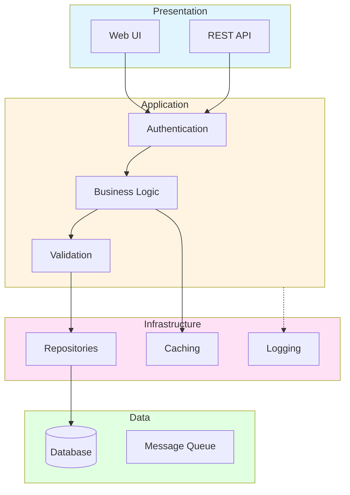

### Microservices Architecture

Show service boundaries and communication patterns:

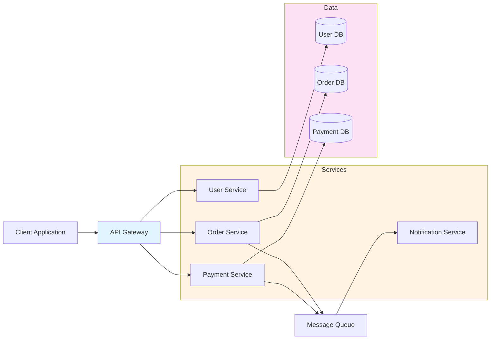

---

## Workflow Diagrams

### Sequence Diagrams

Show interactions between components over time:

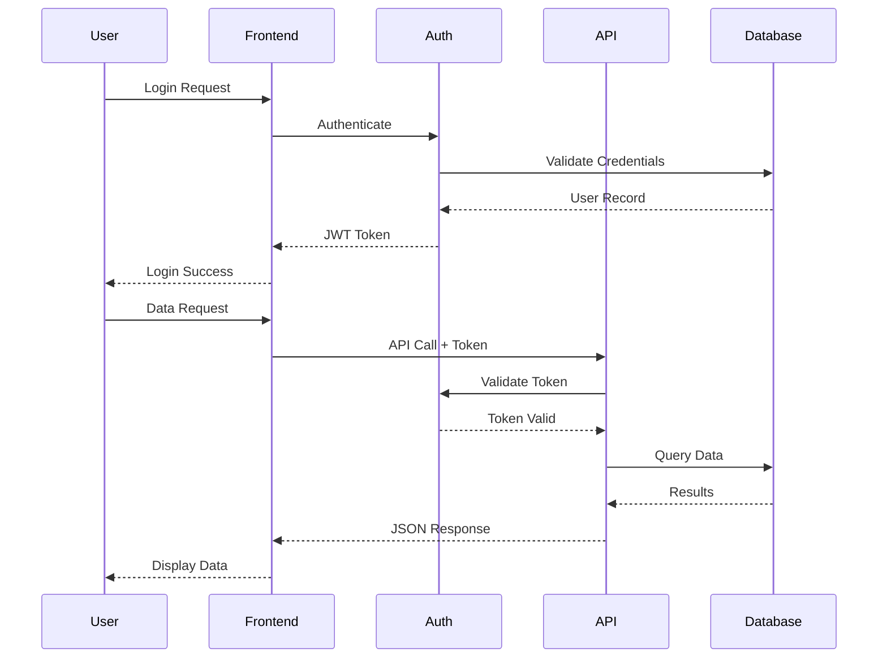

### Process Flow with Decision Points

Show conditional logic and branching:

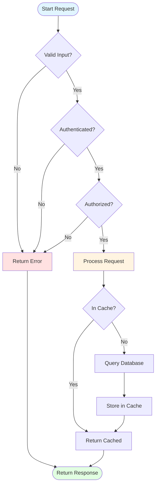

### Parallel Workflows

Show concurrent operations:

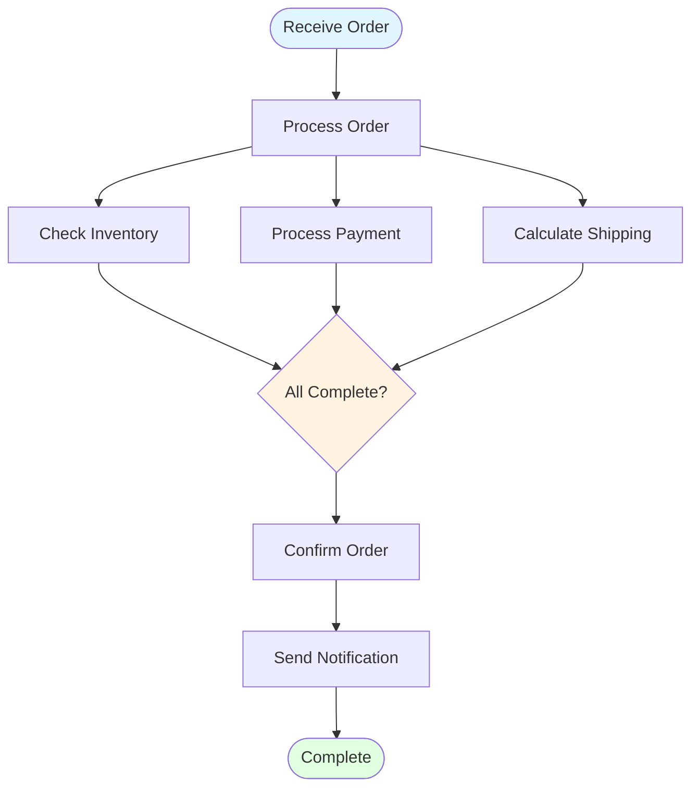

---

## State Diagrams

### Lifecycle State Machine

Show state transitions and triggers:

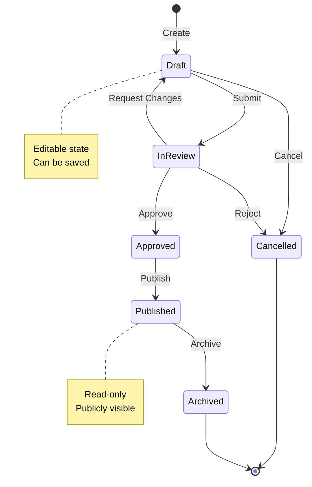

### Order Processing States

Business process with error states:

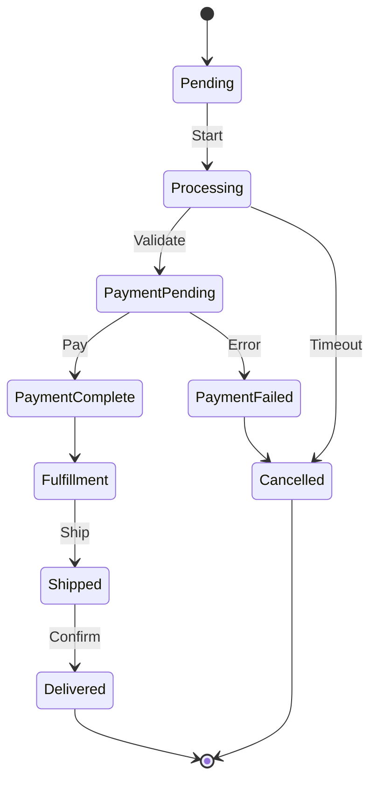

---

## Data Flow Diagrams

### ETL Pipeline

Show data transformation stages:

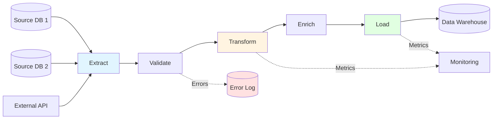

### Event-Driven Architecture

Show event flows and subscribers:

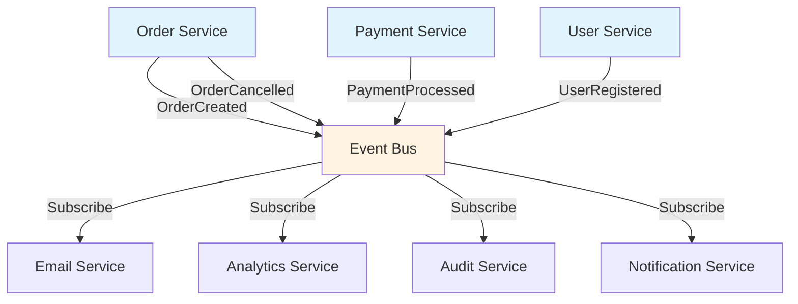

---

## Implementation Phase Diagrams

### TDD Workflow

Show test-first development cycle:

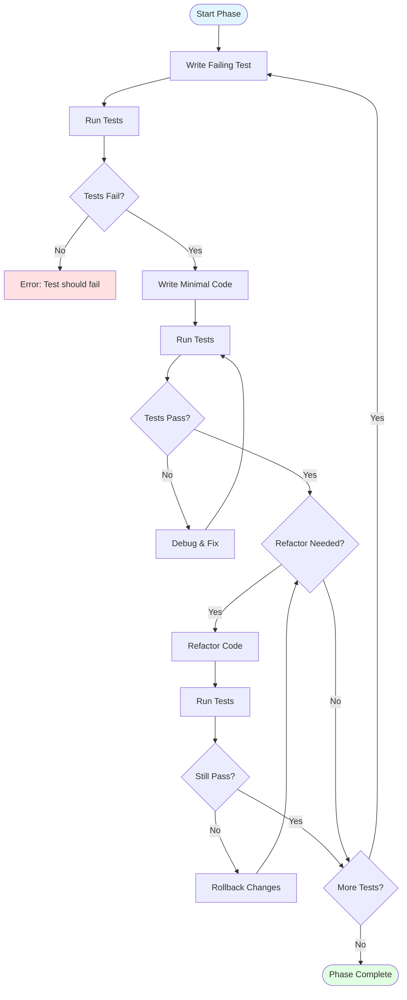

### Code Review Process

Show review workflow with multiple reviewers:

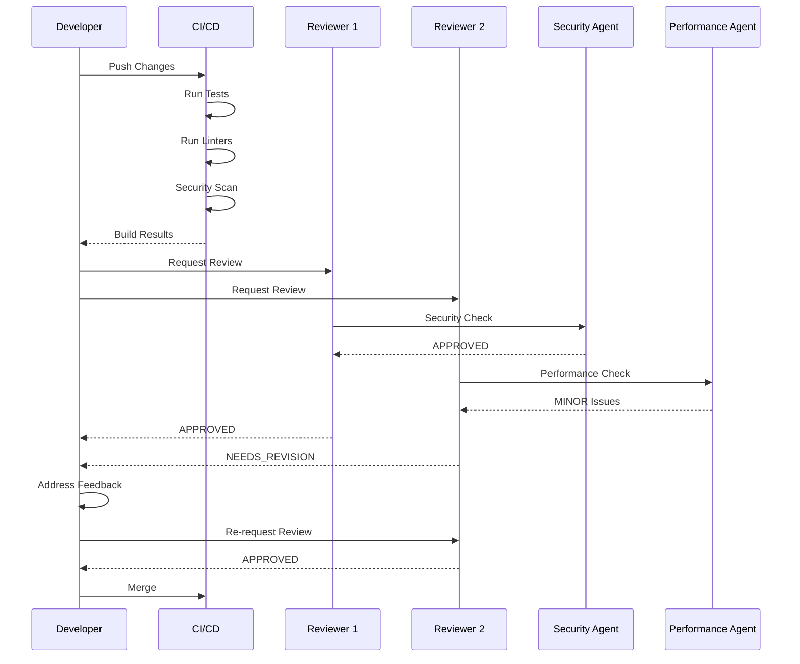

---

## Styling Guidelines

### Color Scheme

Use consistent colors to represent different layers or states:

- **Input/Start**: Light Blue (`#e1f5ff`)
- **Processing**: Light Yellow (`#fff4e1`)
- **Data Storage**: Light Pink (`#ffe1f5`)
- **Output/Success**: Light Green (`#e1ffe1`)
- **Error/Warning**: Light Red (`#ffe1e1`)

### Example with Styling

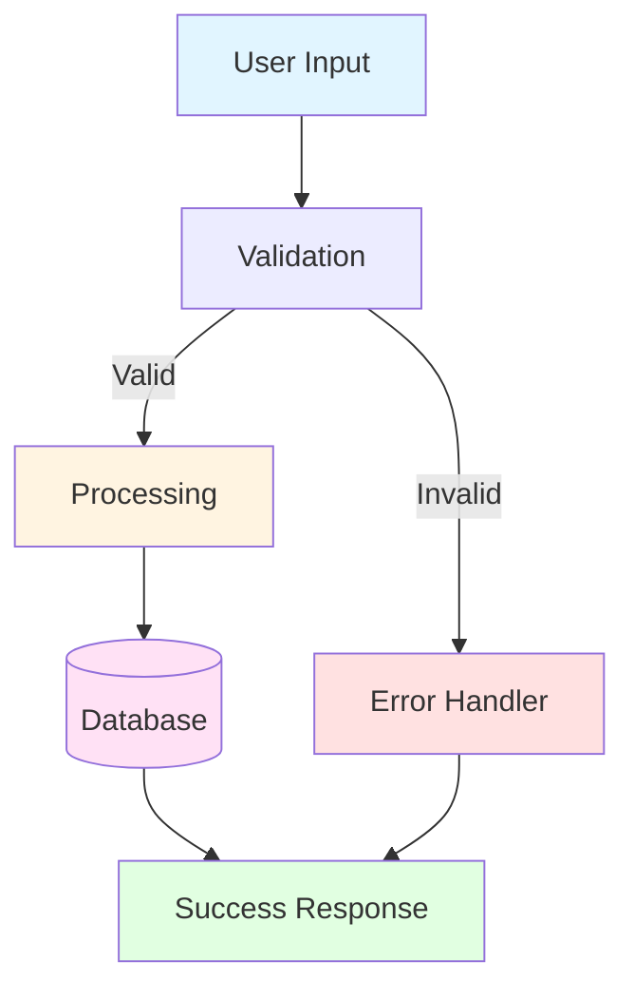

---

## Best Practices

1. **Keep diagrams focused**: One diagram per concern (architecture, workflow, data flow)
2. **Use meaningful labels**: Component names should match actual code/system names
3. **Show key paths only**: Omit implementation details that don't affect the plan
4. **Include legends when needed**: Explain non-obvious notation or color coding
5. **Validate diagram syntax**: Test in Mermaid Live Editor before committing
6. **Update diagrams with code**: Keep visual documentation in sync with implementation

---

## Tools & Resources

- **Mermaid Live Editor**: https://mermaid.live/
- **VS Code Mermaid Extension**: Install "Markdown Preview Mermaid Support"
- **Mermaid Documentation**: https://mermaid.js.org/
- **GitHub Mermaid Support**: Renders automatically in Markdown files

---

## Validation

Before finalizing a plan with diagrams:

- [ ] Diagram syntax is valid (test in Mermaid Live Editor)
- [ ] Labels match actual component/function names
- [ ] Color coding follows the established scheme
- [ ] Diagram adds clarity beyond prose description
- [ ] Related diagrams are consistent in notation
- [ ] Complex diagrams include notes or legends

---

**See Also:**
- `docs/templates/plan.md` - Plan template with diagram sections
- `instructions/workflows/planner.instructions.md` - Planner agent requirements
