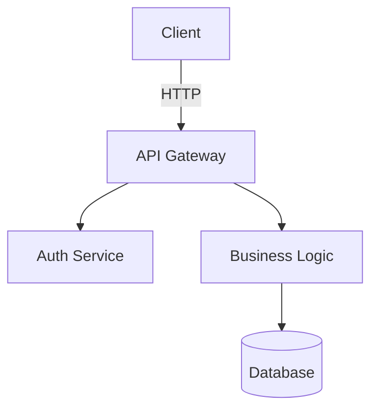
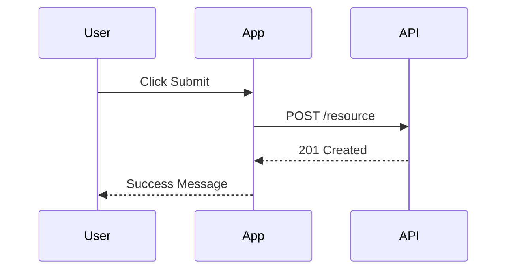
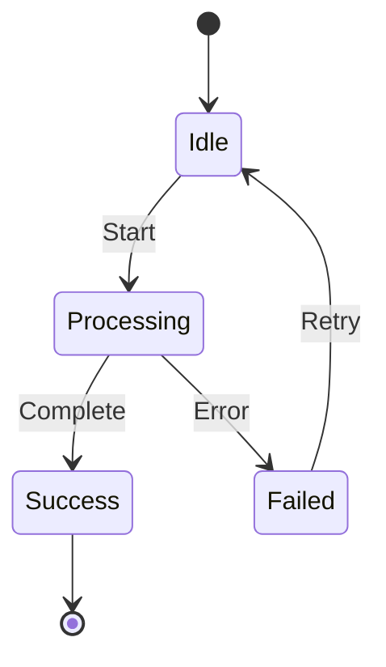

# Claude Skills Migration Guide

> **Feature:** VS Code 1.107+ | **Setting:** `chat.useClaudeSkills: true`

## Overview

VS Code 1.107 can now reuse [Claude Code](https://code.claude.com) skills alongside custom agents. Skills are on-demand capabilities that agents load when needed, similar to plugins or extensions. They come with supporting files like scripts and templates.

This guide shows how to migrate your existing prompt templates and instruction files to Claude skills format, enabling reuse across both VS Code and Claude Code environments.

## Skills vs Agents vs Prompts

| Asset Type | Purpose | When to Use | Reusability |
|------------|---------|-------------|-------------|
| **Custom Agent** | Persistent persona with tools and handoffs | Complex workflows requiring state/delegation | VS Code only |
| **Claude Skill** | On-demand capability with supporting files | Reusable patterns agents can load | VS Code + Claude Code |
| **Prompt File** | Template for specific task | One-off tasks, parameterized generation | VS Code only |

**Rule of Thumb**: If multiple agents need the same knowledge, make it a skill. If it's a persona, make it an agent. If it's a one-time template, make it a prompt.

## Skill Structure

A skill consists of:

```text
.claude/skills/skill-name/
├── SKILL.md              # Required: skill definition
├── templates/            # Optional: supporting files
│   ├── template.md
│   └── schema.json
└── scripts/              # Optional: automation scripts
    └── helper.ps1
```

### SKILL.md Format

```markdown
---
description: "One-line description advertising the skill (shown to agent)"
---

# Skill Name

## Overview
What this skill does and when to use it.

## Instructions
Step-by-step guidance for using this skill.

## Templates
Reference any supporting files here.

## Examples
Show concrete usage examples.
```

## Migration Examples

### Example 1: TDD Workflow Prompt → Skill

**Before** (`.github/prompts/implementation/tdd-workflow.prompt.md`):

```markdown
---
id: tdd-workflow
description: Test-driven development workflow
---

# TDD Workflow

Follow this sequence:
1. Write failing test
2. Implement minimal code
3. Run test to confirm pass
4. Refactor
5. Repeat

...
```

**After** (`.claude/skills/tdd-workflow/SKILL.md`):

```markdown
---
description: "Test-driven development workflow with validation steps"
---

# TDD Workflow Skill

## Overview
Guides agents through red-green-refactor TDD cycle with PowerShell test execution.

## Instructions

1. **Write Failing Test**
   - Create test file in `tests/` directory
   - Use Pester framework syntax
   - Test should fail initially

2. **Implement Minimal Code**
   - Write only enough code to pass the test
   - Avoid gold-plating or premature optimization

3. **Validate**
   - Run: `Invoke-Pester -Path tests/YourTest.Tests.ps1 -Output Detailed`
   - Confirm test passes

4. **Refactor**
   - Improve code structure while keeping tests green
   - Re-run tests after each change

5. **Repeat**
   - Move to next test case

## Supporting Files

See `templates/test-template.ps1` for Pester test structure.

## Example

```powershell
# tests/New-Feature.Tests.ps1
Describe "New-Feature" {
    It "Should return expected value" {
        $result = Invoke-NewFeature -Input "test"
        $result | Should -Be "expected"
    }
}
```
```

**Supporting File** (`.claude/skills/tdd-workflow/templates/test-template.ps1`):

```powershell
Describe "<FeatureName>" {
    BeforeAll {
        # Setup
    }

    It "Should <TestCase>" {
        # Arrange
        $input = "test"

        # Act
        $result = Invoke-Function $input

        # Assert
        $result | Should -Be "expected"
    }

    AfterAll {
        # Cleanup
    }
}
```

### Example 2: Security Review Checklist → Skill

**Before** (`.github/prompts/review/security-checklist.prompt.md`):

```markdown
# Security Review Checklist

- [ ] Input validation
- [ ] Authentication checks
- [ ] Authorization rules
- [ ] SQL injection prevention
- [ ] XSS protection
- [ ] CSRF tokens
...
```

**After** (`.claude/skills/security-review/SKILL.md`):

```markdown
---
description: "STRIDE-based security review checklist with severity tagging"
---

# Security Review Skill

## Overview
Systematic security analysis using STRIDE threat model with actionable findings.

## Instructions

### Phase 1: Scope
Identify assets touched, data flows, and trust boundaries.

### Phase 2: STRIDE Analysis

**Spoofing**: Can identity be forged?
- Check authentication mechanisms
- Verify token validation
- Review session management

**Tampering**: Can data be modified?
- Validate input sanitization
- Check integrity controls
- Review authorization at data layer

**Repudiation**: Can actions be denied?
- Verify audit logging
- Check non-repudiation controls

**Information Disclosure**: Can data leak?
- Review access controls
- Check for PII exposure
- Validate encryption in transit/rest

**Denial of Service**: Can system be overwhelmed?
- Check rate limiting
- Review resource quotas
- Validate circuit breakers

**Elevation of Privilege**: Can access be escalated?
- Review RBAC implementation
- Check for privilege leaks
- Validate least privilege

### Phase 3: Reporting

Use severity tags:
- `[BLOCKER]`: Critical vulnerability
- `[HIGH]`: Significant security risk
- `[MEDIUM]`: Moderate concern
- `[LOW]`: Minor issue

## Templates

See `templates/security-findings.md` for reporting format.

## Example Output

```markdown
## Findings

### [HIGH] SQL Injection Risk
**File**: `api/users.js:42`
**Issue**: User input concatenated directly into SQL query
**Fix**: Use parameterized queries

### [MEDIUM] Missing Rate Limiting
**File**: `api/login.js`
**Issue**: No throttling on authentication endpoint
**Fix**: Implement express-rate-limit
```
```

### Example 3: Mermaid Diagram Patterns → Skill

**Before** (`docs/examples/mermaid-diagram-patterns.md`):

```markdown
# Mermaid Diagram Patterns

## Sequence Diagram
...
## Architecture Diagram
...
```

**After** (`.claude/skills/mermaid-diagrams/SKILL.md`):

```markdown
---
description: "Generate Mermaid diagrams for architecture, workflows, and sequences"
---

# Mermaid Diagram Skill

## Overview
Provides templates and patterns for generating diagrams in Markdown.

## Diagram Types

### Architecture Diagram



### Sequence Diagram



### State Machine



## Templates

See `templates/` folder for specific diagram types:
- `architecture.mermaid.md` - System architecture
- `sequence.mermaid.md` - Interaction flows
- `state.mermaid.md` - State transitions
- `deployment.mermaid.md` - Infrastructure layouts

## Usage

1. Determine diagram type needed
2. Copy appropriate template
3. Customize nodes and relationships
4. Validate syntax at https://mermaid.live
```

## Creating Skills from Scratch

### 1. Identify Reusable Knowledge

Good candidates for skills:
- ✅ Coding patterns used across projects
- ✅ Review checklists and validation steps
- ✅ Documentation templates
- ✅ Troubleshooting procedures
- ✅ Testing strategies

Not suitable for skills:
- ❌ Project-specific configuration
- ❌ One-time tasks
- ❌ Agent personas (use custom agents instead)

### 2. Create Skill Structure

```powershell
# Create skill folder
$skillName = "my-skill"
New-Item -Path ".claude/skills/$skillName" -ItemType Directory
New-Item -Path ".claude/skills/$skillName/templates" -ItemType Directory

# Create SKILL.md
@"
---
description: "Brief one-liner describing this skill"
---

# $skillName Skill

## Overview
What this skill provides.

## Instructions
How to use this skill.

## Supporting Files
List templates and scripts.
"@ | Out-File ".claude/skills/$skillName/SKILL.md" -Encoding UTF8
```

### 3. Add Supporting Files

```powershell
# Add a template
@"
# Template Name

Use this template for...

## Structure
...
"@ | Out-File ".claude/skills/$skillName/templates/template.md" -Encoding UTF8
```

### 4. Test the Skill

```json
{
  "chat.useClaudeSkills": true
}
```

Ask an agent: **"What skills do you have?"**

The agent should list your skill. Then request usage:

**"Use the [skill-name] skill to [task]"**

## Skill Discovery

Agents automatically discover skills from:

**Personal Skills**:
```
~/.claude/skills/skill-name/SKILL.md
```

**Project Skills**:
```
${workspaceFolder}/.claude/skills/skill-name/SKILL.md
```

**Precedence**: Project skills override personal skills with the same name.

## Best Practices

### 1. Write Effective Descriptions

**Good**:
```yaml
description: "WCAG 2.2 accessibility audit with ARIA validation"
```

**Bad** (too vague):
```yaml
description: "Helps with accessibility"
```

The description is shown to agents when they're deciding which skill to load. Be specific!

### 2. Include Concrete Examples

Show don't tell - include working examples in the skill.

### 3. Reference External Resources

Skills can reference URLs:

```markdown
## Resources
- [OWASP Top 10](https://owasp.org/www-project-top-ten/)
- [CWE Database](https://cwe.mitre.org/)
```

### 4. Version Your Skills

Track changes in SKILL.md:

```markdown
---
description: "..."
version: "2.1.0"
updated: "2025-12-19"
---
```

### 5. Keep Skills Focused

One skill = one capability. Don't create mega-skills that do everything.

## Migration Checklist

- [ ] Identify reusable prompts and instructions
- [ ] Create `.claude/skills/` folder structure
- [ ] Convert prompt files to SKILL.md format
- [ ] Extract supporting files to `templates/` subdirectories
- [ ] Add version metadata and descriptions
- [ ] Enable `chat.useClaudeSkills` in VS Code
- [ ] Test skills with agents
- [ ] Update documentation references
- [ ] Archive old prompt files

## Integration with Agents

Custom agents can explicitly reference skills:

```markdown
# My Agent

## Instructions

When reviewing code:
1. Load the `security-review` skill
2. Apply the STRIDE checklist
3. Report findings using the skill template
```

Or let agents discover skills automatically when `infer: true` is set.

## Troubleshooting

### Skill Not Discovered

1. Check `SKILL.md` has `description` in frontmatter
2. Verify folder structure: `.claude/skills/skill-name/SKILL.md`
3. Confirm `chat.useClaudeSkills: true` in settings
4. Restart VS Code
5. Ask agent: "What skills do you have?"

### Skill Loaded but Not Used

1. Improve the `description` to be more specific
2. Explicitly request the skill in your prompt
3. Check if supporting files are accessible
4. Review agent logs for errors

### Supporting Files Not Found

- Use relative paths from SKILL.md: `templates/file.md`
- Ensure files are in the skill folder
- Check file permissions

## Resources

- [Claude Code Skills Documentation](https://code.claude.com/docs/en/skills)
- [VS Code 1.107 Release Notes](https://code.visualstudio.com/updates/v1_107)
- [Copilot Orchestrator Prompt Templates](../../.github/prompts/)

## Examples in This Repository

These prompts are good candidates for skill migration:

| Current Prompt | Suggested Skill Name | Description |
|----------------|----------------------|-------------|
| `planning/ds-star-step.prompt.md` | `ds-star-planning` | Sequential data analysis step planning |
| `implementation/phase-execution.prompt.md` | `phase-execution` | Multi-phase implementation workflow |
| `review/multi-perspective.prompt.md` | `multi-perspective-review` | Standard + adversarial code review |

---

**Updated**: December 2025 (VS Code 1.107)  
**Status**: Experimental → GA expected Q1 2026
