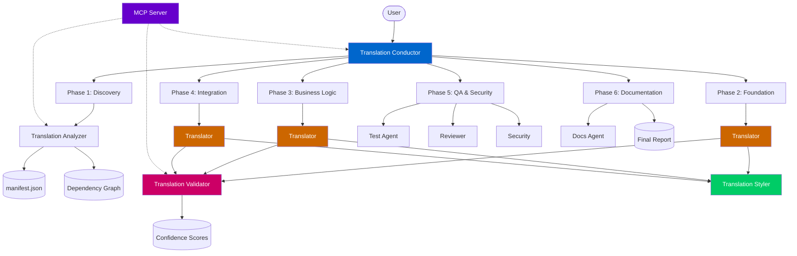

?# Code Translation Orchestration — User Guide

A complete system for autonomously translating entire repositories from one programming language to another using GitHub Copilot custom agents in VS Code.

## Quick Start

### 1. Open your source repository in VS Code

### 2. Start a Copilot Chat session with the Translation Conductor

```
@translation-conductor Translate this repository from Python to TypeScript
```

### 3. Follow the 6-phase lifecycle

The conductor will guide you through each phase with mandatory pause points for your approval.

## Architecture Overview



## Agents

| Agent | Role | When Used |
|-------|------|-----------|
| **Translation Conductor** | Orchestrates the entire workflow | Throughout — coordinates all phases |
| **Translation Analyzer** | Analyzes source repo structure | Phase 1 — builds dependency graph and manifest |
| **Translator** | Translates individual files | Phases 2, 3, 4 — core translation work |
| **Translation Validator** | Validates translated code | After each translation — 6-layer validation stack |
| **Translation Styler** | Applies target language idioms | Post-validation — ensures idiomatic code |
| **Test** | Writes and runs unit/integration tests | Phase 5 — TDD debug cycle |
| **Reviewer** | Code review for correctness | Phase 5 — quality gate |
| **Security** | STRIDE threat modeling | Phase 5 — security assessment |
| **Docs** | Generates all documentation | Phase 6 — technical, business, and test docs |

## The 6-Layer Validation Stack

Every translated file is validated through 6 layers:

| Layer | Weight | What It Checks |
|-------|--------|----------------|
| 1. Syntax | 15% | Does the code parse without errors? |
| 2. Types | 15% | Do all types resolve in strict mode? |
| 3. Lint | 10% | Does it follow target language conventions? |
| 4. Unit Tests | 25% | Do translated unit tests pass? |
| 5. Integration | 15% | Do cross-module tests pass? |
| 6. Equivalence | 20% | Same inputs → same outputs as source? |

## Confidence Rating

### Per-File (0.0–1.0)

| Score | Band | Meaning |
|-------|------|---------|
| 0.9–1.0 | **High** | Passes all layers, fully idiomatic |
| 0.7–0.89 | **Medium** | Minor issues, quick review needed |
| 0.5–0.69 | **Low** | Some tests fail, full review needed |
| <0.5 | **Critical** | Major issues, may need rewrite |

### Repo-Level

LOC-weighted average — larger files contribute more to the score.

## MCP Server (Optional)

For programmatic translation management, use the Translation MCP Server:

```bash
python scripts/mcp/translation_server.py
```

### Available Tools

- `analyze_imports` — Parse import statements
- `build_dependency_graph` — Build dependency DAG
- `translate_file` — Prepare translation context
- `validate_translation` — Run validation commands
- `calculate_confidence` — Compute file-level scores
- `calculate_repo_confidence` — Compute repo-level score
- `suggest_target_dependencies` — Map source → target packages

### Configuration

Add to any agent's frontmatter:
```yaml
mcp-servers:
  translation:
    type: stdio
    command: python
    args: ["scripts/mcp/translation_server.py"]
```

## Deliverables

After a complete translation, you receive:

1. **Target Repository** — Complete translated codebase
2. **Comprehensive Unit Tests** — Matching source test coverage
3. **Technical Documentation** — Architecture guide, API reference, module docs
4. **Business Documentation** — Feature matrix, capability summary, migration guide
5. **Functional Test Documentation** — Test plan, test cases, coverage matrix
6. **Security Review** — STRIDE assessment, vulnerability scan, compliance check
7. **Final Translation Report** — Per-file confidence matrix, aggregate scores, decision log
8. **Translation Manifest** — Full dependency graph and module registry

## Supported Language Pairs

The system supports translation between any pair of:

- Python
- TypeScript / JavaScript
- Rust
- Go
- Java
- C#

Framework mappings are pre-configured for common combinations (see the code-translation skill for the full matrix).

## Validation

Run translation artifact validation:
```powershell
pwsh -File scripts/validate-translation.ps1 -RepositoryRoot .
```

## Pause Points

The conductor enforces 3 mandatory pause points:

1. **After Discovery** — Review and approve the translation plan and manifest
2. **After Foundation** — Review translated types/interfaces before business logic
3. **After Integration** — Review complete translation before QA and documentation

At each pause point, you can:
- Approve and proceed
- Request changes
- Adjust scope
- Ask questions

## Best Practices

1. **Start small** — Test with a small module first to validate the approach
2. **Review types first** — Foundation types affect everything downstream
3. **Check the manifest** — Ensure dependency graph is correct before translating
4. **Trust but verify** — Use confidence scores as a guide, but review low-confidence files
5. **Iterate** — Failed validations get 3 retry attempts before escalation
6. **Keep the source** — Don't modify the source repo during translation

## File Structure

```
.github/
├── agents/
│   ├── translation-conductor.agent.md
│   ├── translator.agent.md
│   ├── translation-analyzer.agent.md
│   ├── translation-validator.agent.md
│   └── translation-styler.agent.md
├── prompts/translation/
│   ├── analyze-repo.prompt.md
│   ├── translate-module.prompt.md
│   ├── validate-translation.prompt.md
│   ├── generate-docs.prompt.md
│   └── final-report.prompt.md
└── skills/code-translation/
    └── SKILL.md

scripts/
├── mcp/translation_server.py
└── validate-translation.ps1

docs/
├── guides/translation-guide.md (this file)
└── templates/translation-report.md

instructions/workflows/
└── translation-conductor.instructions.md
```
