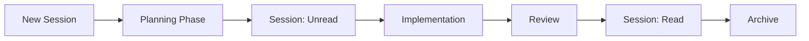

## Purpose
This guide shows how to configure VS Code so the Copilot Orchestrator agents, skills, instructions, and prompts are available in your workspace — and optionally in **every VS Code window** you open.

## Prerequisites
- VS Code 1.114 or later (stable channel supports all features including simplified workspace search, video carousel, cross-session troubleshooting, agent diagnostics, monorepo customization discovery, MCP server sandboxing, image/binary file support, agent autonomy levels, agent-scoped hooks, agent plugins, agentic browser tools, context compaction, session forking, and the Explore subagent).
- Local clone of the `copilot_orchestrator` repository.
- GitHub Copilot subscription (Individual, Business, or Enterprise).

## Understanding Settings Scope

VS Code settings exist at two levels, and choosing the right one determines where your agents are available:

| Scope | File Location | When to Use |
|-------|--------------|-------------|
| **User (global)** | `Ctrl+Shift+P` → "Open User Settings (JSON)" | Agents available in **every** VS Code window |
| **Workspace** | `.vscode/settings.json` in the repo | Agents available only when **this repo is open** |

**Key insight:** Agents defined via workspace-relative paths (e.g., `.github/agents`) only load when that workspace is open. To make agents available globally (in any window, even without this repo open), use **user-level settings with tilde paths**.

### Tilde Path Notation

User-level settings require paths that resolve regardless of workspace. Use `~` (tilde) notation instead of absolute Windows paths:

| Pattern | Example |
|---------|---------|
| **Tilde (recommended)** | `~/OneDrive/Documents/Projects/copilot_orchestrator/.github/agents` |
| **Absolute (avoid)** | `C:\\Users\\Micha\\OneDrive\\Documents\\Projects\\copilot_orchestrator\\.github\\agents` |

VS Code expands `~` to your user home directory (`%USERPROFILE%` on Windows, `$HOME` on macOS/Linux). Tilde paths are portable across machines and avoid issues with backslash escaping.

> **OneDrive users:** If your files are cloud-only (on-demand), agents may fail to load. Right-click the `.github` folder in File Explorer → **Always keep on this device**.

## Setup: User-Level Settings (Global Agents)

Use this configuration to make all 29 orchestrator agents available in **any VS Code window**, even when the copilot_orchestrator repo is not open.

1. Open **User Settings (JSON)**: `Ctrl+Shift+P` → "Preferences: Open User Settings (JSON)"
2. Add the following settings (adjust the tilde path to match your repo location):

   ```json
   {
     "chat.useAgentsMdFile": true,
     "chat.useNestedAgentsMdFiles": true,

     "chat.agentFilesLocations": {
       "~/OneDrive/Documents/Projects/copilot_orchestrator/.github/agents": true
     },
     "chat.agentSkillsLocations": {
       "~/OneDrive/Documents/Projects/copilot_orchestrator/.github/skills": true
     },
     "chat.instructionsFilesLocations": {
       "~/OneDrive/Documents/Projects/copilot_orchestrator/instructions": true
     },
     "chat.promptFilesLocations": {
       "~/OneDrive/Documents/Projects/copilot_orchestrator/.github/prompts": true
     },

     "chat.useAgentSkills": true,
     "chat.agentCustomizationSkill.enabled": true,
     "chat.customAgentInSubagent.enabled": true,
     "chat.subagents.allowInvocationsFromSubagents": true,
     "chat.useCustomAgentHooks": true,
     "chat.tools.terminal.backgroundNotifications": true,
     "chat.tools.confirmationCarousel.enabled": true,
     "chat.agent.sandbox.enabled": "on",
     "github.copilot.chat.claudeAgent.enabled": true,
     "chat.plugins.enabled": true,
     "chat.askQuestions.enabled": true,
     "github.copilot.chat.copilotMemory.enabled": true,
     "github.copilot.chat.searchSubagent.enabled": true,
     "github.copilot.chat.organizationInstructions.enabled": true,
     "github.copilot.chat.customAgents.showOrganizationAndEnterpriseAgents": true,
     "github.copilot.chat.cli.customAgents.enabled": true,
     "github.copilot.chat.implementAgent.model": "Claude Sonnet 4.6 (copilot)",
     "github.copilot.chat.advanced.workspace.codeSearchExternalIngest.enabled": true,

     "chat.thinking.style": "collapsed",
     "chat.agent.thinking.collapsedTools": true,
     "chat.agent.thinking.terminalTools": true,
     "chat.tools.autoExpandFailures": true,
     "github.copilot.chat.anthropic.thinking.budgetTokens": 10000,
     // Thinking effort is now configured via model picker (1.113+).
     // github.copilot.chat.anthropic.thinking.effort and responsesApiReasoningEffort are deprecated.
     "github.copilot.chat.anthropic.toolSearchTool.enabled": true,
     "github.copilot.chat.anthropic.contextEditing.enabled": true,

     "chat.viewSessions.enabled": true,
     "chat.viewSessions.orientation": "sideBySide",
     "chat.restoreLastPanelSession": false,
     "chat.agentsControl.enabled": true,
     "chat.agentsControl.clickBehavior": "cycle",
     "workbench.startupEditor": "agentSessionsWelcomePage",

     "chat.tools.terminal.enableAutoApprove": true,
     "chat.tools.terminal.autoApproveWorkspaceNpmScripts": true,
     "chat.tools.terminal.preventShellHistory": true,
     "terminal.integrated.enableKittyKeyboardProtocol": true,
     "workbench.browser.openLocalhostLinks": true,
     "simpleBrowser.useIntegratedBrowser": true,
     "git.worktreeIncludeFiles": [".env.local", "token-thresholds.json"]
   }
   ```

3. Reload VS Code: `Ctrl+Shift+P` → "Developer: Reload Window"
4. Verify agents loaded: Right-click in Chat → **Diagnostics** — all 29 agents should appear

> VS Code silently skips any tilde paths that don't resolve to existing directories, making it safe to reuse this block across machines.

## Setup: Workspace-Level Settings (Repo-Scoped)

Use this when you only need agents available while the copilot_orchestrator repo is open. Create `.vscode/settings.json` in the repo root:

   ```json
   {
     "chat.instructionsFilesLocations": {
       "instructions": true
     },
     "chat.promptFilesLocations": {
       ".github/prompts": true
     },
     "chat.agentFilesLocations": {
       ".github/agents": true
     },
     "chat.agentSkillsLocations": {
       ".github/skills": true
     },
     "chat.useAgentSkills": true,
     "chat.agentCustomizationSkill.enabled": true,
     "github.copilot.chat.copilotMemory.enabled": true
   }
   ```

Workspace settings layer on top of user settings. If you have user-level global paths, workspace-level relative paths will also be merged in.

## Troubleshooting Agent Availability

| Symptom | Cause | Fix |
|---------|-------|-----|
| Agents missing in new window | Paths are workspace-relative only | Add user-level settings with tilde paths (see above) |
| Agents missing despite user settings | OneDrive files are cloud-only | Right-click folder → "Always keep on this device" |
| Agents missing after VS Code update | Settings renamed | Check for deprecated settings (see below) |
| Some agents load, others don't | Workspace trust not granted | Accept trust prompt for the external path |
| Duplicate agents in Copilot | `.claude/agents/` also discovered | Set `".claude/agents": false` in `chat.agentFilesLocations` (see below) |
| `chat.modeFilesLocations` warning | Setting is deprecated | Remove it; use `chat.agentFilesLocations` instead |
| `chat.viewRestorePreviousSession` warning | Setting renamed in 1.108 | Replace with `chat.restoreLastPanelSession` |
| `anthropic.thinking.effort` no-op | Deprecated in 1.113 | Remove setting; use model-picker thinking effort |
| `responsesApiReasoningEffort` no-op | Deprecated in 1.113 | Remove setting; use model-picker thinking effort |
| `useCustomizationsInParentRepositories` no-op | Deprecated in 1.115 (now default) | Remove setting; parent discovery is automatic |

### Duplicate Agents from `.claude` Folder

If you've run `setup-claude-code.ps1` to create Claude Code–compatible agent files, you'll have converted copies in `.claude/agents/`. VS Code Copilot can discover these alongside the originals in `.github/agents/`, causing every agent to appear twice.

**Fix:** Explicitly exclude `.claude/agents` from agent discovery:

```json
"chat.agentFilesLocations": {
    ".github/agents": true,
    ".claude/agents": false
}
```

Setting a path to `false` tells Copilot to skip that directory. This is already configured in the workspace settings shipped with this repo.

**Diagnostics:** Right-click in Chat panel → **Diagnostics** to see all loaded agents, prompts, instructions, and skills with their resolved paths.

## VS Code 1.109 Features

### Agent Skills (GA)
**Setting:** `chat.useAgentSkills` (default: `true` — now GA)

Agent Skills are now generally available in VS Code 1.109. Skills in `.github/skills/` load automatically when relevant. Configure search paths with `chat.agentSkillsLocations`. The built-in Agent Customization Skill (`chat.agentCustomizationSkill.enabled`) teaches the AI about creating agents, instructions, prompts, and skills.

### Multiple Model Fallbacks
Agent frontmatter now accepts `model` as an array. The first available model is used, providing automatic fallback:

```yaml
model: ['Claude Sonnet 4.6 (copilot)', 'GPT-5.4 (copilot)']
```

All 29 agents in this repo now use model fallback arrays for resilience.

### Agent Invocation Control
New frontmatter attributes for fine-grained control:

- **`user-invokable: false`** — Prevents direct user invocation (internal-only agents)
- **`disable-model-invocation: true`** — Prevents AI-initiated invocation
- **`agents: [list]`** — Subagent allowlist restricting which agents can be delegated to

### Handoff Model Parameters
Handoffs can now specify a `model` parameter for per-handoff model selection:

```yaml
handoffs:
  - label: Security Review
    agent: reviewer
    model: Claude Opus 4.6 (copilot)
    prompt: Perform security review with threat modeling and exploit analysis.
```

### Thinking & Reasoning Enhancements

| Setting | Value | Description |
|---------|-------|-------------|
| `chat.thinking.style` | `"collapsed"` | Renamed from `chat.agent.thinkingStyle` |
| `chat.agent.thinking.terminalTools` | `true` | Shows reasoning interleaved with terminal tool calls |
| `chat.tools.autoExpandFailures` | `true` | Auto-expands failed tool calls for diagnosis |

### Anthropic Model Enhancements
Three new settings optimize Claude model performance:

- **`github.copilot.chat.anthropic.thinking.budgetTokens`** (`10000`) — Budget for interleaved thinking via Messages API. This is an Anthropic-specific token count; it is **not** the same as the VS Code 1.113+ model-picker **thinking effort** control. The model-picker effort supersedes the older `anthropic.thinking.effort` and `responsesApiReasoningEffort` settings, but `budgetTokens` remains a valid per-request cap for Anthropic models.
- **`github.copilot.chat.anthropic.toolSearchTool.enabled`** (`true`) — Helps Claude discover relevant tools from larger pools
- **`github.copilot.chat.anthropic.contextEditing.enabled`** (`true`) — Clears old tool results/thinking to maintain more useful context

### Ask Questions Tool
**Setting:** `chat.askQuestions.enabled` (default: `true`)

Agents can now ask clarifying questions instead of making assumptions. This is especially useful for the Planner and Conductor agents during the discovery phase. The `askQuestions` tool has been added to conductor, planner, and reviewer agents.

### Agent Sessions Enhancements

| Setting | Value | Description |
|---------|-------|-------------|
| `chat.agentsControl.enabled` | `true` | Agent status indicator in command center |
| `chat.agentsControl.clickBehavior` | `"cycle"` | Cycle chat view states on click |
| `workbench.startupEditor` | `"agentSessionsWelcomePage"` | Surfaces recent sessions on startup |

**New Features:**
- **Session Type Picker**: Switch between local, background, cloud, and Claude Agent sessions
- **Agent Status Indicator**: Command center badge showing in-progress, unread, and attention-needed sessions
- **Parallel Subagents**: Independent subtasks run in parallel across multiple subagents

### Search Subagent
**Setting:** `github.copilot.chat.searchSubagent.enabled` (`true`)

Iterative code search runs in an isolated context window, preventing search operations from consuming the main conversation context.

### Copilot Memory (Preview)
**Setting:** `github.copilot.chat.copilotMemory.enabled` (`true`)

Replaces the legacy `github.copilot.chat.tools.memory.enabled`. Stores and recalls information across sessions for persistent agent context.

### Organization Instructions
**Setting:** `github.copilot.chat.organizationInstructions.enabled` (`true`)

Auto-applies org-level custom instructions, enabling consistent behavior across all repositories in your GitHub organization.

### External Indexing
**Setting:** `github.copilot.chat.advanced.workspace.codeSearchExternalIngest.enabled` (`true`)

Enables remote indexing for non-GitHub workspaces, making code search fast even for local-only repositories.

### Integrated Browser (Preview)

| Setting | Value | Description |
|---------|-------|-------------|
| `workbench.browser.openLocalhostLinks` | `true` | Opens localhost URLs in integrated browser |
| `simpleBrowser.useIntegratedBrowser` | `true` | Uses new integrated browser with DevTools |

### Plan Agent
**Setting:** `github.copilot.chat.implementAgent.model` (`"Claude Sonnet 4.6 (copilot)"`)

The `/plan` command provides a 4-phase workflow (Discovery → Alignment → Design → Refinement) with integrated `askQuestions`. The `implementAgent.model` setting controls which model is used for the implementation step.

### Claude Agent (Preview)
New session type using Anthropic's agent SDK. Available from the session type picker alongside local, background, and cloud agent sessions.

### MCP Apps
Interactive UI from MCP servers rendered directly in chat, enabling rich tool interactions.

### Chat Diagnostics
Right-click in Chat → Diagnostics to see all loaded agents, prompts, instructions, and skills. Useful for debugging configuration issues.

### `/init` Command
Auto-generates workspace instruction files based on codebase analysis — accelerates onboarding for new repositories.

### Other New Settings

| Setting | Value | Description |
|---------|-------|-------------|
| `terminal.integrated.enableKittyKeyboardProtocol` | `true` | Better key handling (shift+enter in agentic CLIs) |
| `git.worktreeIncludeFiles` | array | Copies specified files to worktrees for background agents |
| `inlineChat.affordance` | `"editor"` | Inline chat affordance in editor (changed from boolean to enum in 1.110) |

## VS Code 1.117 Features

Released 2026-04-22. BYOK for Business and Enterprise, incremental chat rendering, and terminal UX updates.

### Bring Your Own Key (BYOK) for Business and Enterprise
BYOK lets Business and Enterprise users connect provider API keys (OpenRouter, Ollama, Google, OpenAI, Anthropic, and more) for chat and agents. Admins can disable the **Bring Your Own Language Model Key** policy in GitHub Copilot settings.

**Notes:**
- Usage is billed by the chosen provider and does not consume Copilot AI credits.
- BYOK does not apply to code completions.

### Incremental Rendering of Chat Responses (Experimental)
**Settings:**
- `chat.experimental.incrementalRendering.enabled` (default: `true`)
- `chat.experimental.incrementalRendering.animationStyle` (`none`, `fade`, `rise`, `blur`, `scale`, `slide`, `reveal`)
- `chat.experimental.incrementalRendering.buffering` (`off`, `word`, `paragraph`)

### Terminal Improvements
- Copilot CLI profile can launch from any terminal profile (fixes non-default shell launch errors).
- Terminal tabs can show agent CLI titles. **Setting:** `terminal.integrated.tabs.allowAgentCliTitle` (default: `true`).
- Background terminal commands now surface as system notifications in chat (uses `chat.tools.terminal.backgroundNotifications`).

## VS Code 1.116 Features

Released 2026-04-16. Iterative release with persistent debug logs, CLI thinking effort, foreground terminal support, and enterprise network filtering.

### Persistent Agent Debug Logs
**Setting:** `github.copilot.chat.agentDebugLog.fileLogging.enabled` (default: `false`)

Promoted from single-session view (1.112) to persistent on-disk storage. The Agent Debug Log panel now shows historical sessions in addition to the current one. Combined with `/troubleshoot`, this enables cross-session root-cause analysis without needing to replay sessions.

Our [scripts/analyze-sessions.ps1](../../scripts/analyze-sessions.ps1) remains the CI/batch path; `/troubleshoot` + persistent logs is the interactive path. See [policy-and-operations.md §1](policy-and-operations.md).

### Thinking Effort in Copilot CLI
**Where:** Copilot CLI language-model picker (arrow submenu on reasoning models).

Parity with the 1.113 local-session control. Non-reasoning models do not show the submenu. Effort levels vary per model.

**Usage pattern:** select a reasoning model in the picker, then select the arrow to reveal None / Low / Medium / High.

### Foreground Terminal Support for Agent Tools
**Tools affected:** `send_to_terminal`, `get_terminal_output`

Agents can now read from and send input to **foreground terminals** — any terminal visible in the terminal panel, including user-opened REPLs, running dev servers, or interactive installers — not just agent-created background terminals.

**New patterns this enables:**
- `implementer` agent can interact with a running `npm run dev` watcher
- `ops` agent can respond to interactive CLI prompts (`gh auth login`, `az login`)
- `test` agent can drive a live Python/Node REPL during debugging

### Terminal Input Improvements
- **LLM-based input detection removed** — the agent now uses `send_to_terminal` directly instead of classifying every output chunk. Reduces per-command token overhead.
- **Focus Terminal button** — when the agent needs interactive input (e.g., `npm init` prompts), the question carousel offers a shortcut to type directly in the terminal. Start typing in the terminal to auto-dismiss the carousel.

### Background Terminal Notifications (Default Flipped)
**Setting:** `chat.tools.terminal.backgroundNotifications` (default: `true` as of 1.116)

Background terminal commands now push notifications on completion / timeout / input-needed. Agents respond faster and spend fewer tokens polling for terminal output.

### Tool Confirmation Carousel (Experimental)
**Setting:** `chat.tools.confirmationCarousel.enabled` (Insiders default: `true`; Stable rollout in progress)

Batch-approval UI for multi-tool sequences. Instead of scrolling through the conversation to approve each tool call, a compact carousel lets you navigate and approve in sequence. Useful for conductor multi-file edits under Default Approvals permission mode.

### Customizations Welcome Page
**Where:** Chat Customizations dialog (gear icon or **Chat: Open Customizations**) → welcome page.

Overview of all agent customizations in one view. The welcome page includes a **Customize Your Agent** input that drafts agents, skills, and instructions from a natural-language description. Overlaps our `/create-agent` / `/create-skill` / `/create-instruction` slash commands (1.110) — the welcome page is a better entry point for new contributors; the slash commands remain faster for experienced authors.

### Group Policy: Agent Network Filter (Enterprise)
**Settings** (all enforced via enterprise group policy):

| Setting | Purpose |
|---|---|
| `chat.agent.networkFilter` | Enable the filter |
| `chat.agent.allowedNetworkDomains` | Allowlist (wildcards like `*.example.com` supported) |
| `chat.agent.deniedNetworkDomains` | Blocklist (precedence over allow) |

**Group policy keys:** `ChatAgentNetworkFilter`, `ChatAgentAllowedNetworkDomains`, `ChatAgentDeniedNetworkDomains`.

When the filter is enabled and both lists are empty, **all domains are blocked**. When `chat.agent.sandbox.enabled` is also enabled, the network rules extend to the terminal sandbox.

See [policy-and-operations.md §7](policy-and-operations.md) for our recommended allowlist.

### Sandbox Setting Name (1.110 → 1.116 Reconciliation)
**Current setting:** `chat.agent.sandbox.enabled`  (values: `"on"`, `"off"`, or `true` / `false`)

Our workspace [.vscode/settings.json](../../.vscode/settings.json) already uses this key. Older user configs may still carry the deprecated `chat.tools.terminal.sandbox.enabled`; remove it and use the current setting.

### GitHub Copilot Built-in
GitHub Copilot Chat is now a built-in extension in VS Code — no separate install required. Use `chat.disableAIFeatures` to opt out for users who don't want AI features.

### GitHub Pull Requests 0.136.0
Extension gains a chat tool for creating pull requests, plus worktree deletion in the **Delete Local Branches and Remotes** command. Our `ops` agent's PR workflow currently wraps `gh pr create` — the built-in tool is a candidate replacement.

### Diffs in Top-Level Chat
Code diffs now render directly in the conversation instead of a separate diff view. Changes the reviewer agent's feedback surface — findings can be inline-tagged against visible diffs.

---
## VS Code 1.115 Features

Released 2026-04-08. Several preview features graduated to GA in this release.

### Agent-Scoped Hooks (GA)
**Setting:** `chat.useCustomAgentHooks` (default: `true`)

Promoted from preview (1.111) to GA. Define pre/post-tool, session-lifecycle, user-prompt-submitted, and error-handling hooks in YAML frontmatter of `.agent.md` files. Each hook runs only when its owning agent is active.

**Example hook declaration:**

```yaml
hooks:
  - event: post-tool
    match: { tool: "edit_file", path: "**/.github/**" }
    run: "pwsh -File scripts/validate-copilot-assets.ps1 -RepositoryRoot ."
```

Our roster does not yet use hooks — tracked as gap **G1** in `artifacts/research/copilot-sota-gap-analysis-2026-04-22.md`. Priority candidates: `implementer` (post-edit validation), `reviewer` (pre-load security context), `conductor` (session-lifecycle writes `activeContext.md`).

### Monorepo Parent-Folder Discovery (GA)
**Behavior change** — No setting required (now automatic).

Promoted from preview (1.112 behind `chat.useCustomizationsInParentRepositories`) to default behavior. When you open a subfolder, Copilot walks parent directories up to the repository root to discover `AGENTS.md`, `copilot-instructions.md`, instructions, prompts, agents, skills, and hooks. Only active when the opened folder is not itself a Git repository and a parent contains `.git`.

> **Deprecation:** `chat.useCustomizationsInParentRepositories` is retained for pre-1.115 compatibility but is a no-op in 1.115+. Remove it from your settings.

> **Impact on central deployment:** The symlink pattern in `docs/guides/central-deployment.md` is now **only** needed for pre-1.115 versions or non-VS-Code clients. New users on 1.115+ should use parent-folder discovery instead of symlinks.

### Integrated Browser Debug (GA)
**Debug type:** `editor-browser`

Promoted from experimental (1.112). Set breakpoints, step through code, and inspect the DOM in the integrated browser without leaving VS Code. Launch and Attach configurations supported. Migration from `msedge` / `chrome` is usually just a `type` change in `launch.json`.

### Standalone Code-Review Repo Rule (GitHub platform)
**Where:** Repository rulesets on github.com (not a VS Code setting).

A new standalone rule enforces Copilot code review on pull requests at the repo level — independent of any workflow or CI configuration. Interacts with our `reviewer` agent: the reviewer produces chat-level findings; the repo rule is a CI-level gate. Ensure they don't double-gate the same PR.

### Faster `#codebase`
See the 1.114 section below — a single auto-managed semantic index replaces the local/remote split. Reindexing may be needed for workspaces that previously used local-only indexes.

### Image & Video in Chat (Expanded)
Attachments now include videos with playback controls, navigable alongside images in the carousel. Agent outputs can return both. Our `gui-tester` agent gained image/video input support in commit `54b0980` (FOLLOWUP-G13).

---
## VS Code 1.114 Features

### Workspace Search Simplification
The `#codebase` tool is now purely semantic search — no more fuzzy text fallback. The local/remote index distinction has been removed; indexing is automatic and managed by VS Code. Agents get faster, more consistent context without any user configuration.

**What changed:**
- `#codebase` always returns semantic results (no fuzzy fallback)
- No more local vs remote index management — single "indexed or not" state
- Workspaces previously using local indexes may require reindexing
- `github.copilot.chat.advanced.workspace.codeSearchExternalIngest.enabled` may no longer be necessary (auto-managed)

### Video Carousel
**Settings:** `imageCarousel.chat.enabled`, `imageCarousel.explorerContextMenu.enabled`

The image carousel now supports video playback with controls and thumbnail navigation. Videos from chat attachments or the Explorer context menu play inline with the same carousel UI used for images.

### Copy Final Response
New context menu command in the Chat view copies only the final Markdown section of an agent response — excludes thinking process and tool calls. Useful for sharing conductor deliverables, plan summaries, or review findings.

### Troubleshoot Previous Sessions
**Settings:** `github.copilot.chat.agentDebugLog.enabled`, `github.copilot.chat.agentDebugLog.fileLogging.enabled`

The `/troubleshoot` skill can now reference any previous chat session using `#session`. Attach a session via `+` (Add Context) > Sessions, or include `#session` in the troubleshoot prompt to open a session picker.

### Claude Agent Group Policy (Enterprise)
**Setting:** `github.copilot.chat.claudeAgent.enabled` (managed by `Claude3PIntegration` group policy)

Administrators can disable the Claude agent integration via device management group policy. When applied, users cannot override the setting.

### Fine-grained Tool Approval (Proposed API)
Proposed `approveCombination` property on `LanguageModelToolConfirmationMessages` scopes approval to specific argument combinations — e.g., approving `editor.action.formatDocument` without approving all VS Code commands. Relevant to our tool-approval-policy when this graduates from proposed.

### TypeScript 6.0
Built-in JavaScript and TypeScript support now uses TypeScript 6.0, which deprecates a number of older options in preparation for the TypeScript 7.0 native rewrite.

## VS Code 1.113 Features

Released 2026-03-25. Thinking-effort control, nested subagents, and MCP cross-runtime bridging.

### Configurable Thinking Effort (Model Picker)
**Where:** Model picker → effort submenu (None / Low / Medium / High). Persists per-model across conversations.

Replaces two deprecated settings:

| Deprecated setting | Replacement |
|---|---|
| `github.copilot.chat.anthropic.thinking.effort` | Model-picker effort control |
| `github.copilot.chat.responsesApiReasoningEffort` | Model-picker effort control |

Remove both from your settings if present — they are no-ops in 1.113+.

> **Note:** `github.copilot.chat.anthropic.thinking.budgetTokens` is **not** deprecated. It caps Anthropic thinking token count per request and is orthogonal to the effort control. Keep it configured (default `10000`, we use `32000` for security review work).

Our agent frontmatter uses `thinkingEffort:` as a recommendation-only hint that a user's picker should honour by default. See `instructions/global/01_quality.instructions.md` for the per-tier default allocation.

### Nested Subagents
**Setting:** `chat.subagents.allowInvocationsFromSubagents` (default: `false`)

Enables a subagent to invoke another subagent directly without relaying through the conductor. System limit: depth 5. Our policy: **depth ≤ 2** with an explicit allow-list in `AGENTS.md`.

**Our allow-listed edges:**

| Parent → Child | Rationale |
|---|---|
| implementer → test | Add coverage mid-task |
| implementer → researcher | Quick library lookup |
| reviewer → researcher | Gather evidence for a finding |
| reviewer → reviewer[security] | Standard review escalates to security mode |
| planner → researcher | Finalize a phase with one more piece of evidence |
| translation-conductor → translator / translation-analyzer | Per-file dispatch |

All other edges relay through the conductor. Explicitly denied: `implementer → reviewer`, `implementer → implementer`, `* → conductor`, `reviewer → implementer`, `ops → *`, `gui-tester → *`.

Every nested invocation emits `artifacts/sessions/hooks/nested-call.jsonl` with `{parent, child, depth, purpose, ts}`.

### MCP Cross-Runtime
MCP servers configured in VS Code now bridge automatically to:

- Copilot CLI sessions (`copilot chat`)
- Claude agent sessions

Our six MCP servers (`validation`, `analytics`, `research`, `translation`, `design`, `github`) are stdio-based and work in all three runtimes. See `docs/guides/mcp-integration.md` for per-runtime caveats (sandboxing is macOS/Linux only).

### Claude Agent Integration
**Setting:** `github.copilot.chat.claudeAgent.enabled` (default: `true`; managed by `Claude3PIntegration` group policy in Enterprise)

Session type picker includes "Claude Agent" alongside local, background, and cloud sessions. Uses the Anthropic agent SDK directly.

### Chat Customizations Editor (Preview)
Unified UI for browsing and managing instructions, agents, skills, plugins, and MCP servers in one panel. Replaces navigating multiple file locations manually. Access via **Chat: Open Customizations** command.

### Session Forking in CLI
`/fork` command extended from local sessions to Copilot CLI sessions. Branch a CLI session to explore alternatives without losing the main conversation.

---
## VS Code 1.112 Features

### `/troubleshoot` Skill (Preview)
**Settings:** `github.copilot.chat.agentDebugLog.enabled`, `github.copilot.chat.agentDebugLog.fileLogging.enabled`

Analyzes agent debug logs directly in the conversation to diagnose why tools, subagents, instructions, or skills weren’t applied correctly, or what caused slow responses. Type `/troubleshoot` followed by your question. Both settings must be enabled and VS Code reloaded.

### Agent Debug Log Export/Import
**Setting:** `github.copilot.chat.agentDebugLog.enabled`

Export and import JSONL debug logs from the Agent Debug Logs panel for sharing and offline analysis. Importing files >50 MB shows a warning. Useful for troubleshooting across teams and archiving session diagnostics.

### Image & Binary File Support
**Settings:** `chat.imageCarousel.enabled` (Experimental), `imageCarousel.explorerContextMenu.enabled` (Experimental)

Agents can now read image files from disk and binary files (presented in hexdump format). Agent-generated images (e.g., screenshots from the integrated browser) appear in a selectable carousel view. Right-click images/folders in Explorer → **Open Images in Carousel** when the context menu setting is enabled.

### Automatic Symbol References
When you copy a symbol name (class, function, method) and paste it into chat, VS Code auto-converts it to a `#sym:Name` reference, giving the agent richer context. Use **Paste as Text** (`Ctrl+Shift+V`) to paste without conversion.

### Copilot CLI Enhancements
- **Permissions Levels**: Default Permissions, Bypass Approvals, and Autopilot now available for Copilot CLI sessions
- **Message Steering/Queueing**: Send messages while a CLI request is running to steer or queue follow-ups
- **Pending Changes Preview**: Chat view shows uncommitted changes when delegating to Copilot CLI
- **Clickable File Links**: Terminal recognizes `~/.copilot/session-state/` paths (`github.copilot.chat.cli.terminalLinks.enabled`, default: `true`)

### Monorepo Customizations Discovery
**Setting:** `chat.useCustomizationsInParentRepositories` (default: `false`)

In monorepo setups where you open a subfolder, VS Code now discovers customization files from parent folders up to the repository root. Applies to all customization types: `copilot-instructions.md`, `AGENTS.md`, `CLAUDE.md`, instruction files, prompt files, agents, skills, and hooks. Only active when the workspace folder is not itself a Git repository and a parent contains `.git`.

### MCP Server Sandboxing
Set `"sandboxEnabled": true` for a server in `mcp.json` to restrict file system and network access for locally running stdio MCP servers. When a sandboxed server needs additional access, VS Code prompts for permission.

> **Note:** Sandboxing is only available on macOS and Linux. Not currently available on Windows.

### Improved MCP Elicitation UI
MCP elicitation forms now use the same UI as the Ask Questions tool for a consistent experience when MCP servers request additional information.

### Plugin & MCP Enable/Disable
Plugins and MCP servers can now be enabled/disabled globally and per-workspace without uninstalling. Right-click entries in the Extensions view or Chat: Open Customizations view.

### Automatic Plugin Updates
**Setting:** `extensions.autoUpdate`

Plugins auto-update based on the `extensions.autoUpdate` setting. Plugins from npm and pypi registries require approval before updating, as updates may run new code on your machine.

### Integrated Browser Debugging
New `editor-browser` debug type for debugging web apps directly in the integrated browser with Launch and Attach configurations. Most options from existing `msedge` and `chrome` debug configs are supported — migration is often as simple as changing the `type` in `launch.json`.

### Integrated Browser UX Improvements
**Setting:** `workbench.browser.pageZoom`

- **Context menus**: Right-click in browser pages for copy/paste, open in new tab, and inspect
- **Independent zoom**: Browser has its own zoom level, independent from VS Code window zoom. Zoom remembered per website
- **Default zoom**: Configure with `workbench.browser.pageZoom` (set to `"Match Window"` or leave unset to match VS Code zoom)

## VS Code 1.111 Features

### Agent Permissions Picker (Preview)
**Setting:** `chat.autopilot.enabled` (default: `true` in Insiders, `true` when enabled in Stable)

Three autonomy levels configurable per session via the Chat view permissions picker:

| Level | Behavior | Use Case |
|-------|----------|----------|
| **Default Approvals** | Standard approval prompts | Conductor workflows with pause points |
| **Bypass Approvals** | Auto-approve tools, auto-retry errors | Trusted implementation tasks |
| **Autopilot** | Full auto: tools + questions + retry | Background tasks, lint runs, autonomous work |

> **Warning:** Autopilot auto-responds to `askQuestions`, bypassing conductor pause points. Use Default Approvals for workflows requiring human approval gates.

### Agent-Scoped Hooks (Preview)
**Setting:** `chat.useCustomAgentHooks` (default: `true` when enabled)

Define pre- and post-processing logic per agent via a `hooks` section in `.agent.md` YAML frontmatter. Hooks run before/after agent execution without affecting other chat interactions.

### Debug Events Snapshot
Attach `#debugEventsSnapshot` in the chat composer to pass token consumption, loaded customizations, and agent state into the conversation for self-diagnosis.

### `task_complete` Tool
Required for Autopilot mode — agents must explicitly call `task_complete` to signal completion. In Default/Bypass modes, normal session flow applies.

### AI Terminal Profile Grouping (Experimental)
**Setting:** `terminal.integrated.experimental.aiProfileGrouping` (default: `false`)

Groups AI CLI terminal profiles (GitHub Copilot CLI, etc.) at the top of the terminal profile dropdown.

### Other 1.111 Improvements
- **Search Subagent**: Results no longer written to disk; refined token usage reporting
- **Session Autonomy**: Permissions picker is per-session; adjustable mid-session
- **Tips Overhaul**: Foundational tips shown first; `/fork` and `/init` actively promoted

## VS Code 1.110 Features

### Agent Plugins (Experimental)
**Setting:** `chat.plugins.enabled` (default: `true`)

Installable bundles of skills, tools, and hooks from the Extensions view. Configure sources with `chat.plugins.marketplaces` and `chat.plugins.paths`.

### Agentic Browser Tools (Experimental)
**Setting:** `workbench.browser.enableChatTools` (default: `true`)

Gives agents full browser control with tools: `openBrowserPage`, `navigatePage`, `readPage`, `screenshotPage`, `clickElement`, `hoverElement`, `dragElement`, `typeInPage`, `handleDialog`, `runPlaywrightCode`. Enables web app testing and interaction from agent sessions.

### Explore Subagent
**Setting:** `chat.exploreAgent.defaultModel` (`"Claude Haiku 4.5 (copilot)"`)

The Plan agent delegates codebase research to the Explore subagent, which runs in a read-only context with a fast model. Replaces expensive inline search calls during planning.

### Context Compaction
**Command:** `/compact`

Manual context window control with optional custom instructions. Background and Claude agents also support compaction with context window rendering. Use during long sessions to free context space.

### Session Forking
**Command:** `/fork`

Creates an independent session branch with inherited conversation history. Explore alternative approaches without losing the main thread.

### Agent Debug Panel
**Command:** `Developer: Open Agent Debug Panel`

Replaces the old Chat Diagnostics right-click action. Shows loaded agents, instructions, skills, prompts, and MCP servers in a dedicated panel.

### Edit Mode Deprecated
**Setting:** `chat.editMode.hidden` (default: `true`)

Edit mode is hidden from the mode picker by default and will be removed in VS Code 1.125. Agent mode replaces Edit mode for file editing.

### Create Agent Customizations
New slash commands for scaffolding customization files from chat: `/create-prompt`, `/create-instruction`, `/create-skill`, `/create-agent`, `/create-hook`.

### Usages & Rename Tools
The `usages` tool has been updated and a `rename` tool added for LSP-aware refactoring available to agents.

### Terminal Enhancements

| Setting | Value | Description |
|---------|-------|-------------|
| `chat.tools.terminal.simpleCollapsible` | `true` | Collapses terminal tool calls for reduced visual noise |
| `chat.tools.terminal.sandbox.enabled` | `true` | Restricts agent terminal access (filesystem, network) — Preview |
| `terminal.integrated.enableImages` | `true` | GPU-accelerated image rendering via Kitty Graphics Protocol |

### Inline Chat Overhaul

| Setting | Value | Description |
|---------|-------|-------------|
| `inlineChat.affordance` | `"editor"` | Changed from boolean to enum (`"off"`, `"editor"`, `"gutter"`) |
| `inlineChat.renderMode` | `"hover"` | Adds hover-based UI for inline chat |

Inline chat now queues into active agent sessions instead of running independently.

### Notifications & OS Integration

| Setting | Value | Description |
|---------|-------|-------------|
| `chat.notifyWindowOnResponseReceived` | `"always"` | OS notifications when agent responds |
| `chat.notifyWindowOnConfirmation` | `"always"` | OS notifications when approval needed |
| `workbench.notifications.position` | `"bottom-left"` | Avoids overlapping Chat view |

### Other 1.110 Settings

| Setting | Value | Description |
|---------|-------|-------------|
| `git.addAICoAuthor` | `"chatAndAgent"` | Adds Copilot as co-author in commit messages |
| `chat.tips.enabled` | `true` | Contextual tips for agent features and workflows |

### Auto-Approve Slash Commands
`/autoApprove` and `/disableAutoApprove` (aliases: `/yolo`, `/disableYolo`) toggle tool auto-approval directly from chat.

### Anti-Suspend
VS Code prevents the OS from suspending the machine while a chat response is in progress.

## VS Code 1.108 Features

### Agent Skills (Experimental)
**Setting:** `chat.useAgentSkills` (default: `false` in 1.108, now `true` in 1.109)

Agent Skills enable on-demand loading of domain-specific knowledge from `.github/skills/` folders. Each skill is a directory containing a `SKILL.md` file that defines behavior, scripts, and resources. VS Code loads skills progressively when relevant to your request.

**Status:** Experimental. See Phase 6 of our integration plan for pilot program details.

### Enhanced Terminal Features
**Settings:**
- `chat.tools.terminal.enableAutoApprove` — Auto-approve safe commands like `git ls-files`, `rg`, `sed`, `Out-String`
- `chat.tools.terminal.autoApproveWorkspaceNpmScripts` — Auto-approve npm/pnpm/yarn scripts from `package.json`
- `chat.tools.terminal.preventShellHistory` — Exclude agent commands from shell history (default: `true`)

**Custom Glyphs:** VS Code 1.108 adds ~800 GPU-accelerated terminal glyphs including powerline symbols, progress indicators, git branch symbols, and braille patterns. No custom fonts required.

### Agent Sessions Improvements
**Settings:**
- `chat.viewSessions.orientation` — Use `"sideBySide"` (the `"auto"` option has been deprecated)
- `chat.restoreLastPanelSession` — Controls whether previous chat is restored on startup (default: `false` for empty chat)

**New Features:**
- Keyboard access for archive, read state, and open actions
- Session grouping by state and age when viewing side-by-side
- Changed files and associated PRs displayed per session
- Multi-session archiving support
- Quick access via "agent " in Quick Open (Ctrl+P)

### Terminal IntelliSense
Now requires **Ctrl+Space** to trigger by default (previously showed automatically while typing). This reduces interruptions for terminal power users while keeping the feature accessible.

## Terminal Auto-Approve (VS Code 1.108)

### Overview

VS Code 1.108 introduces intelligent auto-approval of safe terminal commands, reducing prompts while maintaining security. When agents or users run known-safe commands, VS Code executes them immediately rather than requesting approval.

### Auto-Approved Commands

When `chat.tools.terminal.enableAutoApprove` is enabled (default: `true`), these commands execute without prompts:

#### Git Commands
- `git ls-files` — List tracked files
- `git --no-pager <safe_subcommand>` — Read-only Git operations (status, log, diff, show, branch, tag)
- `git -C <dir> <safe_subcommand>` — Git operations in specific directory

#### Search and Text Tools
- `rg` (ripgrep) — Excludes dangerous flags like `--pre` and `--hostname-bin`
- `sed` — Text stream editing (with safety restrictions on dangerous patterns)

#### PowerShell Output
- `Out-String` — Convert objects to strings for display

### NPM Scripts Auto-Approve

**Setting:** `chat.tools.terminal.autoApproveWorkspaceNpmScripts` (default: `true`)

Scripts defined in `package.json` are auto-approved when run through npm, pnpm, or yarn:

```json
{
  "scripts": {
    "build": "tsc",           // ✓ Auto-approved
    "test": "jest",           // ✓ Auto-approved
    "lint": "eslint ."        // ✓ Auto-approved
  }
}
```

**Rationale:** Workspace Trust is already required for agents. Since agents cannot edit `package.json` (protected file), scripts are trusted.

**To disable:** Set `chat.tools.terminal.autoApproveWorkspaceNpmScripts: false`

### Shell History Exclusion

**Setting:** `chat.tools.terminal.preventShellHistory` (default: `true`)

Agent-run commands are excluded from your shell history by default. This keeps your history clean and focused on your manual commands.

**How it works:**
- **Bash/Zsh:** Sets `HISTCONTROL=ignorespace` and prefixes commands with a space
- **PowerShell:** Uses `-NoProfile` execution where appropriate
- **Fish:** Uses Fish-specific history control

**To include in history:** Set `chat.tools.terminal.preventShellHistory: false`

### Denial Transparency

When a command is denied by auto-approve rules, VS Code displays a clear informational message explaining why:

```
❌ Command denied by auto-approve rules
Command: rm -rf /
Reason: Dangerous file deletion detected
Action: Review command and run manually if needed
```

This transparency helps you understand security decisions and adjust your workflow.

### Validation Scripts and Auto-Approve

Our PowerShell validation scripts work seamlessly with auto-approve:

#### Auto-Approved Scripts
These scripts use only safe, read-only operations:

```powershell
# ✓ Auto-approved - read-only operations
.\scripts\validate-copilot-assets.ps1 -RepositoryRoot .
.\scripts\run-lint.ps1 -RepositoryRoot .
.\scripts\run-smoke-tests.ps1 -RepositoryRoot .
.\scripts\token-report.ps1 -Path .

# ✓ Auto-approved - Git read operations
git ls-files
git status
git diff
```

#### Requires Approval
Scripts that modify files or system state require explicit approval:

```powershell
# ⚠ Requires approval - modifies files
.\scripts\add-prompt-metadata.ps1 -RepositoryRoot .

# ⚠ Requires approval - creates artifacts
.\scripts\init-artifacts.ps1
```

### Security Best Practices

#### ✅ DO:
- Leave `enableAutoApprove` enabled for better workflow
- Review denial messages to understand security boundaries
- Use validation scripts frequently (they're auto-approved)
- Trust workspace npm scripts in your `package.json`

#### ⚠️ CONSIDER:
- Disable auto-approve in highly restricted environments
- Set `autoApproveWorkspaceNpmScripts: false` for untrusted repositories
- Review auto-approve logs periodically

#### ❌ DON'T:
- Override denial decisions without understanding the risk
- Disable `preventShellHistory` unless you need command history
- Assume all commands are auto-approved (check denial messages)

### Example Workflow

**Scenario:** Running conductor workflow validation

```powershell
# Agent runs validation (auto-approved ✓)
.\scripts\validate-copilot-assets.ps1 -RepositoryRoot .
# ✓ Executed immediately - no prompt

# Agent checks Git status (auto-approved ✓)
git status
# ✓ Executed immediately - no prompt

# Agent wants to modify metadata (requires approval ⚠)
.\scripts\add-prompt-metadata.ps1 -RepositoryRoot .
# ⚠ Prompt shown: "Allow this script to modify files?"
```

### Troubleshooting

**Issue:** Commands still prompting despite auto-approve enabled

**Solutions:**
1. Verify setting: `"chat.tools.terminal.enableAutoApprove": true`
2. Restart VS Code after changing settings
3. Check command matches safe patterns (see list above)
4. Review denial message for specific reason

**Issue:** NPM scripts not auto-approved

**Solutions:**
1. Verify setting: `"chat.tools.terminal.autoApproveWorkspaceNpmScripts": true`
2. Ensure scripts are in `package.json` (not run via `npx` or global packages)
3. Check Workspace Trust is enabled

**Issue:** Commands appearing in shell history

**Solutions:**
1. Verify setting: `"chat.tools.terminal.preventShellHistory": true`
2. Ensure shell integration is enabled and working
3. Check terminal type supports history control (bash, zsh, pwsh, fish)

### Related Settings

```json
{
  "chat.tools.terminal.enableAutoApprove": true,
  "chat.tools.terminal.autoApproveWorkspaceNpmScripts": true,
  "chat.tools.terminal.preventShellHistory": true,
  "terminal.integrated.shellIntegration.enabled": true
}
```

## Agent Sessions UI (VS Code 1.108)

### Overview

VS Code 1.108 introduces powerful Agent Sessions management features that make it easier to track, organize, and archive conductor workflows. The enhanced UI provides keyboard navigation, intelligent grouping, and multi-session operations.

### Keyboard Navigation

Navigate and manage sessions entirely from the keyboard:

#### Navigation Keys
- **↑/↓ (Arrow Keys)** — Move between sessions in the list
- **Enter** — Open selected session in editor
- **Delete** — Archive selected session
- **Space** — Toggle read/unread state

#### Multi-Selection
- **Shift+Click** — Select range of sessions
- **Ctrl+Click (Cmd+Click on Mac)** — Add/remove individual sessions from selection

#### Batch Operations
Once multiple sessions are selected:
- **Delete** — Archive all selected sessions at once
- **Space** — Mark all selected sessions as read/unread

**Example Workflow:**
```
1. Click first completed session
2. Shift+Click last completed session
3. Press Delete → All selected sessions archived
```

### Session Grouping

When `chat.viewSessions.orientation` is set to `"sideBySide"`, sessions are automatically grouped for better organization:

#### Group by State
- **Active** — Currently in-progress conductor workflows
- **Unread** — Completed sessions not yet reviewed
- **Read** — Reviewed sessions ready for archiving
- **Archived** — Historical sessions for reference

#### Group by Age
- **Today** — Sessions from the current day
- **Yesterday** — Sessions from the previous day
- **This Week** — Sessions from the current week
- **This Month** — Sessions from the current month
- **Older** — Historical sessions beyond current month

**Toggle Grouping:**
Use the grouping dropdown in the Agent Sessions view header to switch between State, Age, or None.

### Changed Files and PRs

Each session now displays associated context:

#### Changed Files Indicator
- Sessions show the number of files modified during the workflow
- Click the files indicator to expand and see the full list
- Each file is clickable to open in the editor

**Example:**
```
🎯 conductor — VS Code 1.108 Integration
   📁 7 files changed
      ├── vscode-copilot-configuration.md
      ├── copilot-instructions.md
      ├── terminal-formatting.instructions.md
      └── ...
```

#### Pull Request Links
- Sessions that resulted in commits show linked PRs
- Click PR number to open in default browser
- Status badge shows PR state (Open, Merged, Closed)

**Example:**
```
🎯 conductor — OAuth2 Implementation
   📁 12 files changed
   🔀 PR #247 (Merged)
```

### Quick Open Integration

Access Agent Sessions directly from Quick Open (Ctrl+P / Cmd+P):

**Syntax:** `agent <session_name>`

**Examples:**
```
agent oauth          → Find sessions about OAuth
agent Phase 3        → Find Phase 3 sessions
agent conductor      → Filter conductor workflows
```

**Workflow:**
1. Press Ctrl+P (Cmd+P on Mac)
2. Type `agent ` (with space)
3. Type search terms
4. Press Enter to open selected session

### Session Persistence

**Setting:** `chat.restoreLastPanelSession` (default: `false`)

Controls whether VS Code restores the last active session on startup.

#### Recommended: `false` (Default)
- **Start Fresh:** Each VS Code launch begins with an empty chat
- **Prevents Context Leakage:** Avoids accidental continuation of previous work
- **Clean State:** Ensures conductor starts with clear phase tracking

**Use Case:** Multi-project environments where sessions should not cross boundaries

#### Optional: `true`
- **Continue Where You Left Off:** Restores the last active session
- **Useful for:** Single long-running tasks interrupted by restarts
- **Caution:** May lead to context confusion if switching between projects

**Configuration:**
```json
{
  "chat.restoreLastPanelSession": false  // Recommended for conductor workflows
}
```

### Session Organization Best Practices

#### During Planning
- Start each conductor task in a new session
- Use descriptive initial prompts ("Implement OAuth2 authentication")
- VS Code uses this as the session title

#### During Implementation
- Mark sessions as unread when needing follow-up
- Use changed files indicator to verify phase scope
- Group by State to see active vs completed workflows

#### After Completion
- Review phase-complete.md artifacts
- Mark session as read (Space key)
- Archive when work is committed (Delete key)
- Link PR in session notes for traceability

#### Batch Cleanup
- Weekly: Shift+Click range of old sessions → Delete
- Monthly: Archive all Read sessions from previous month
- Before major release: Archive all completed feature sessions

### Workflow Integration

#### Conductor Lifecycle
Agent Sessions integrate seamlessly with conductor pause points:



**At Each Phase:**
1. **Planning** — Session starts, conductor delegates to Planner
2. **Pause** — User reviews plan, session marked Unread
3. **Implementation** — User approves, session continues with Implementer
4. **Review** — Reviewer validates changes, session marked Read
5. **Completion** — Phase-complete.md created, session ready to archive

#### Multi-Phase Projects
For projects with 5-7 phases (like VS Code integrations):

- **Keep session active** through all phases
- Use phase-complete.md artifacts as checkpoints
- Changed files indicator shows cumulative scope
- Archive only after plan-complete.md and final validation

#### Parallel Workflows
When running multiple conductor tasks simultaneously:

- Group by State to see all Active sessions
- Use session titles to differentiate ("Feature A", "Bug Fix B")
- Archive completed sessions to reduce clutter
- Link related PRs in session notes

### Troubleshooting

**Issue:** Sessions not grouping by state or age

**Solutions:**
1. Verify setting: `"chat.viewSessions.orientation": "sideBySide"`
2. Restart VS Code after changing orientation
3. Check Agent Sessions view is in Panel (not Sidebar)
4. Use grouping dropdown to select desired grouping mode

**Issue:** Changed files not showing for session

**Solutions:**
1. Ensure session includes tool calls that modified files
2. Check files were saved during the session
3. Verify workspace is a Git repository (changed files tracked via Git)
4. Refresh Agent Sessions view (reload icon)

**Issue:** Keyboard shortcuts not working

**Solutions:**
1. Ensure Agent Sessions view has focus (click in the view)
2. Check for keybinding conflicts (File → Preferences → Keyboard Shortcuts)
3. Verify VS Code version is 1.108 or later
4. Try restarting VS Code

**Issue:** Previous session restoring on startup

**Solutions:**
1. Set `"chat.restoreLastPanelSession": false`
2. Restart VS Code after changing setting
3. Manually archive unwanted session
4. Start new session with clear prompt

### Related Settings

```json
{
  "chat.viewSessions.enabled": true,
  "chat.viewSessions.orientation": "sideBySide",
  "chat.restoreLastPanelSession": false
}
```

## Claude Agent Sessions (Preview)

VS Code 1.109 introduces Claude Agent as a new session type, powered by Anthropic's agent SDK. This complements the existing conductor workflow by providing a native Anthropic-hosted agent experience.

### When to Use Each Session Type

| Session Type | Best For | Context | Model |
|---|---|---|---|
| **Local (Conductor)** | Multi-phase orchestrated work | Full workspace access, 29 custom agents | Your choice via model picker |
| **Background** | Long-running implementation | Git worktree isolation, auto-commit | Configured model |
| **Cloud** | Quick tasks, PR-focused work | GitHub-hosted, repo access | Cloud model selection |
| **Claude Agent** | Deep reasoning, complex analysis | Anthropic SDK, native Claude tools | Claude models only |

### Configuration

Claude Agent sessions appear automatically in the session type picker when using Anthropic models with your Copilot subscription. No additional configuration is needed beyond having Claude models available.

### Interop with Conductor Workflow

- **Plan locally, implement with Claude Agent**: Use the conductor to create an implementation plan, then hand off to Claude Agent for deep implementation work
- **Research with Claude Agent, orchestrate locally**: Use Claude Agent for complex research requiring extended thinking, then bring findings back to the conductor
- **Session type picker**: Switch between session types mid-workflow using the picker in the chat input area

### Limitations (Preview)

- Claude Agent sessions do not load custom agents or instructions from `.github/agents/`
- Handoffs from conductor to Claude Agent require manual session switching
- Memory is shared across session types when `copilotMemory` is enabled

## MCP Server Integration

This workspace includes MCP servers configured in `.vscode/mcp.json`:

| Server | Purpose | Used By |
|---|---|---|
| `github` | GitHub API operations (issues, PRs, repos) | github-ops agent |
| `filesystem` | Workspace file operations | All agents |
| `design-server` | Brand colors, components, contrast checking | design agent |
| `research-server` | Research and context gathering | researcher agent |

MCP Apps (GA in VS Code 1.109) render interactive UI directly in chat responses. Servers can return rich visualizations like flame graphs, dashboards, and forms.

### Adding New MCP Servers

Add entries to `.vscode/mcp.json` following the existing pattern. For private registries, use the `registryBaseUrl` property (new in 1.109).

## Terminal Lifecycle Tools

VS Code 1.109 introduced new terminal lifecycle tools for better background process management:

| Tool | Purpose | When to Use |
|---|---|---|
| `timeout` | Set max execution time for terminal commands | Always — prevents runaway processes |
| `awaitTerminal` | Wait for a background terminal to complete | When a build/test must finish before next step |
| `killTerminal` | Terminate a background terminal | Clean up servers, stop stale processes |

### Best Practices

- Always specify a `timeout` value when running terminal commands (0 = no timeout)
- Use `awaitTerminal` instead of `sleep` or `echo "done"` patterns to wait for background work
- Use `killTerminal` to stop old server processes before starting new ones
- Background terminals always start in the workspace directory; non-background terminals persist their working directory

### Terminal Sandboxing

Terminal sandboxing restricts file system and network access for agent-executed commands. **Available on macOS and Linux only** — on Windows, sandbox settings have no effect.

When enabled (`chat.tools.terminal.sandbox.enabled: true`):
- Commands can only read/write within the workspace folder
- Network access is blocked by default (configurable per domain)
- No confirmation dialog since commands run in a controlled environment

## Optional Enhancements
- Define tool set collections via `chat.tools.sets` when you create shared tool groups in `.github/toolsets.jsonc`.
- Control terminal approvals with `chat.tools.terminal.autoApprove` to match your security posture.
- Sync prompt and instruction files across machines by enabling Settings Sync for “Prompts and Instructions.”
- Review the **Chat History & Memory** panel to curate notes that custom agents should inherit; with memory enabled, the conductor and `#runSubagent` calls can re-use decisions from prior sessions.

## Custom Agent Delegation in Practice
- Launch complex work in the Conductor — it is the only agent with handoff buttons. All other agents delegate autonomously via `#runSubagent` using the `delegation-routing` skill.
- **Cross-agent custom agents**: With `chat.customAgentInSubagent.enabled`, you can invoke different agent personas from within a custom agent:
  ```
  Run the researcher agent as a custom agent to investigate authentication patterns.
  Use the security agent in a custom agent to threat-model the API design.
  ```
- **Monitor all sessions**: Open the Agent Sessions view (Panel → Agent Sessions) to see conductor workflows, delegated cloud agents, and CLI sessions in one place.
- When delegating manually, include scope, files, and expectations so memory captures the context for follow-up personas.
- Encourage specialists (Security, Performance, Visualizer, Docs) to append memory notes summarizing their findings for downstream agents.
- Clear or update memory entries before starting a new initiative to avoid cross-talk between projects.

## Saving Successful Sessions
When a conductor session produces a valuable workflow, capture it for reuse:

1. After completing the workflow, type `/savePrompt` in the chat input.
2. VS Code generates a `.prompt.md` file with placeholders for variable inputs.
3. Review the generated prompt and save it to `.github/prompts/` for team use.
4. Document the new prompt in `docs/CHANGELOG.md` and add metadata with `scripts/add-prompt-metadata.ps1`.

Example use cases:
- Complex refactoring patterns that worked well
- Multi-phase implementation workflows
- Effective research + planning + implementation sequences

## Verification Checklist
1. Restart VS Code Insiders after saving the settings.
2. Open the Chat view and confirm agents (Conductor, Planner, Implementer, Reviewer, Researcher, Maintainer, Security, Performance, Accessibility, Docs, Observability, Visualizer, Deployment, Red Team, Test, Lint, GitHub Ops, Terraform, Bicep, Design, Beast Mode, Rubber Duck) appear in the agent picker.
3. Type `/` in chat and ensure prompt files from `.github/prompts` are listed.
4. Select the Conductor and verify handoff buttons appear. Other agents should delegate autonomously via `#runSubagent`.
5. Confirm the memory indicator shows as enabled (gear icon → “Chat > Tools > Memory”) and pin any critical context for the next session.
6. Run the following commands to confirm instructions and prompts remain valid:
   - `./scripts/run-lint.ps1`
   - `./scripts/run-smoke-tests.ps1`
   - `Invoke-Pester -Path tests`

## Troubleshooting
- If modes or prompts are missing, ensure the settings paths match the workspace layout and that `chat.promptFiles` is enabled.
- Handoffs only appear in VS Code Insiders; update to the latest build if buttons are absent.
- If tool approvals appear too often, adjust the per-tool approval settings or consolidate tool sets.
- Regenerate the token budget report (`./scripts/token-report.ps1`) after adding new instructions or prompts to keep CI thresholds current.

## References
- [Custom chat modes in VS Code](https://code.visualstudio.com/docs/copilot/customization/custom-chat-modes)
- [Use custom instructions](https://code.visualstudio.com/docs/copilot/customization/custom-instructions)
- [Use prompt files](https://code.visualstudio.com/docs/copilot/customization/prompt-files)
- [Use tools in chat](https://code.visualstudio.com/docs/copilot/chat/chat-tools)
