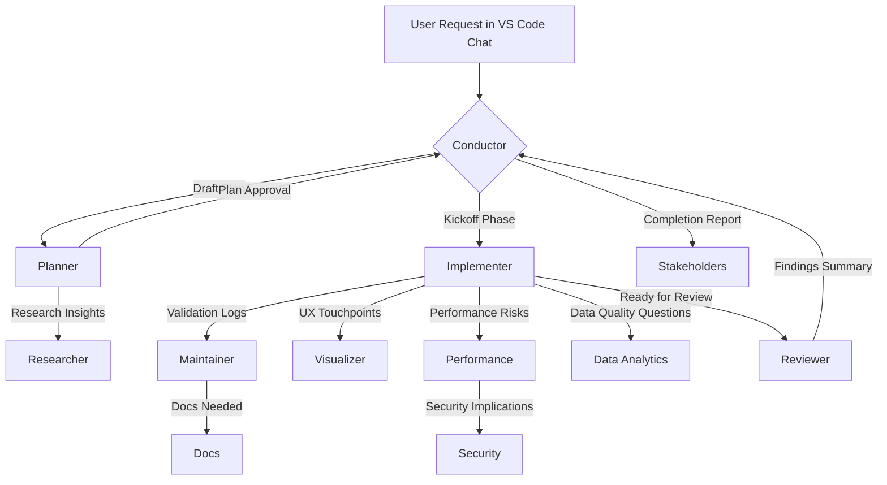

## Audience & Purpose
Builders who juggle architecture docs, pull requests, and validation suites can now offload the orchestration work to a curated team of Copilot agents. This post showcases how the Copilot Orchestrator repository transforms a single request into a coordinated plan, implementation, review, and deployment story.

## Why Orchestrator Instead of Solo Chat?
- **Lifecycle discipline:** The Conductor agent enforces plan → implementation → review checkpoints so nothing ships without human approval.
- **Role clarity:** Planner, Implementer, Reviewer, Maintainer, Security, Performance, Visualizer, Data Analytics, and Docs each own their slice of expertise.
- **Zero setup drift:** A shared configuration repo keeps prompts, instructions, and tooling aligned across every workstation.
- **Observable outcomes:** Every phase produces artifacts aligned with the included templates, making audits and handoffs painless.

## Dataflow of a Typical Request
The diagram below traces how a feature request travels through the orchestrator. Each arrow highlights the persona handoffs that keep state synchronized, including the new Visualizer and Data Analytics specialists.

## Feature Highlights at a Glance
- **Maintainer persona** keeps the backlog tidy, verifies validation output, and packages pull requests for humans.
- **Visualizer persona** critiques UX flows, accessibility guardrails, and diagrams before they reach customers.
- **Data Analytics persona** audits metrics, dashboards, and ETL logic so decisions stay trustworthy.
- **Instruction mesh** blends global, workflow, compliance, and language overlays to guide every agent response.
- **Validation suite** bundles lint, smoke, metadata, and token-budget checks into reusable PowerShell scripts.

## Getting Started in 3 Steps
1. **Clone the repo** somewhere accessible on every device (for example `C:\Copilot\copilot_orchestrator`).
2. **Apply the shared settings** from `docs/guides/vscode-copilot-configuration.md` so VS Code Insiders loads the agent definitions, prompts, and instructions automatically.
3. **Launch a Conductor session** and run a sample task—watch the planner produce a plan, the implementer ship with tests-first discipline, and the reviewer gate keepers finish the loop.

## Call to Action
Level up your multi-agent workflows by wiring this repo into your global Copilot configuration today. Invite teammates, share transcripts, and let the orchestrator shoulder the coordination work so you can focus on shipping brilliant features.