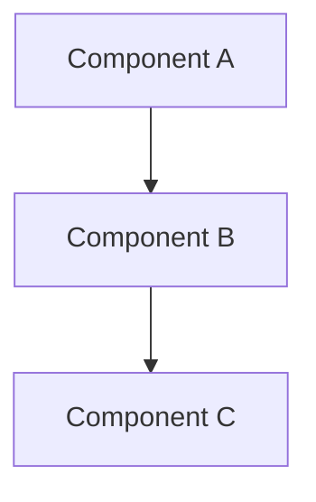
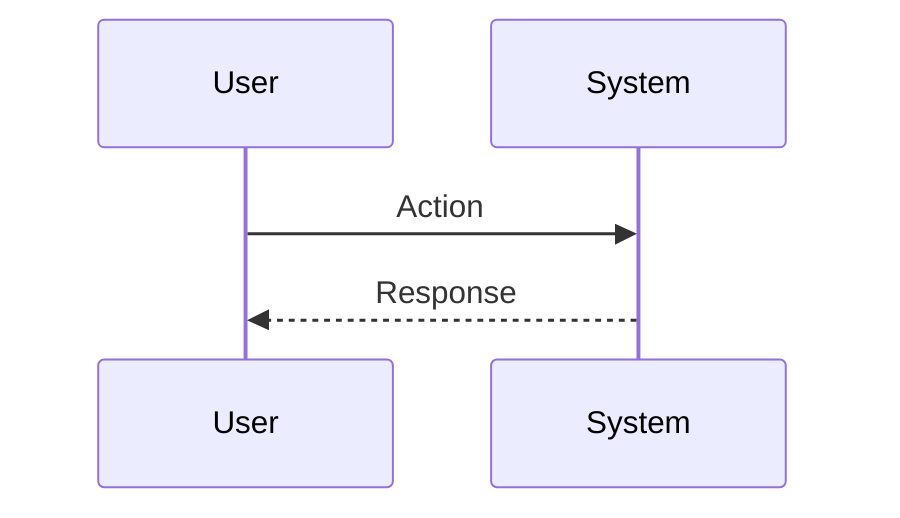

## Plan: {Task Title}

{Brief TL;DR of the plan (1–3 sentences).}

**Architecture Overview** (Optional - for complex changes)

**Workflow Diagram** (Optional - for multi-phase workflows)

**Phases**
1. **Phase {N}: {Phase Title}**
   - **Objective:** {Outcome for this phase}
   - **Files/Functions:** {Key files or paths}
   - **Tests:** {Target suites or new tests}
   - **Steps:**
     1. {Step 1}
     2. {Step 2}
     3. {Step 3}

2. ...

**Open Questions**
1. {Question}
2. {Question}

**Risks & Mitigations**
- Risk: {Description}
  - Mitigation: {Plan}

**Compliance Checkpoints**
- {Checkpoint description}
