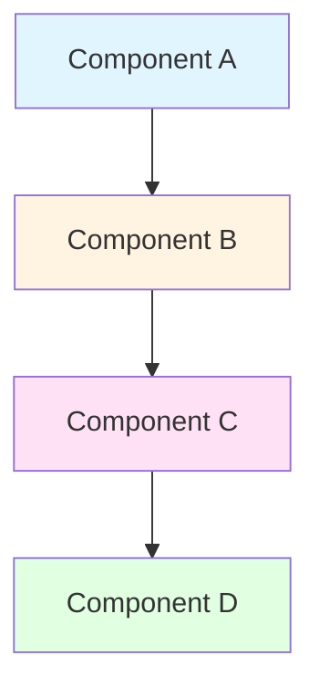
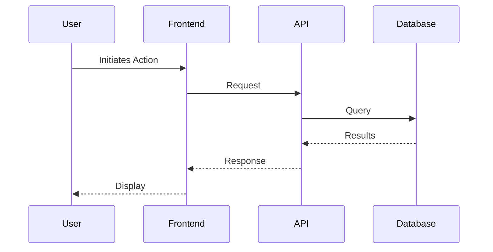
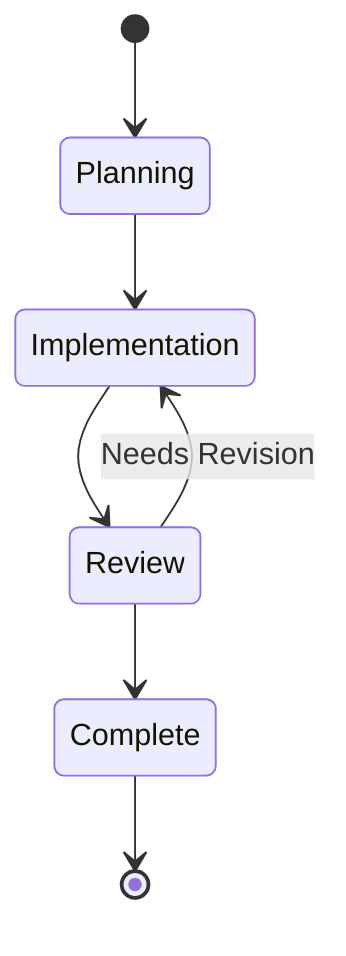
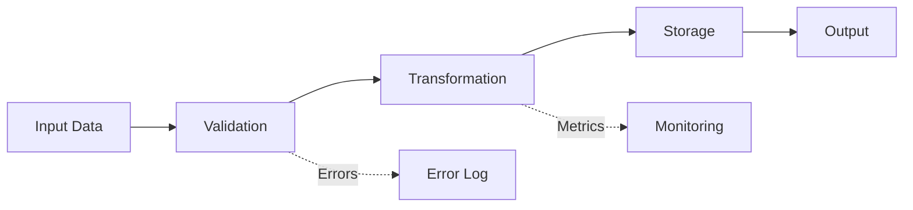

## Plan: {Task Title}

{Brief TL;DR of the plan (1–3 sentences).}

### Architecture Overview

**System Architecture** (Required for structural changes)

```mermaid
flowchart TD
    A[Component A] --> B[Component B]
    B --> C[Component C]
    C --> D[Component D]

    style A fill:#e1f5ff
    style B fill:#fff4e1
    style C fill:#ffe1f5
    style D fill:#e1ffe1
```

**Workflow Sequence** (Required for multi-step processes)

```mermaid
sequenceDiagram
    participant User
    participant Frontend
    participant API
    participant Database

    User->>Frontend: Initiates Action
    Frontend->>API: Request
    API->>Database: Query
    Database-->>API: Results
    API-->>Frontend: Response
    Frontend-->>User: Display
```

**State Machine** (Use for lifecycle or workflow states)

```mermaid
stateDiagram-v2
    [*] --> Planning
    Planning --> Implementation
    Implementation --> Review
    Review --> Implementation: Needs Revision
    Review --> Complete
    Complete --> [*]
```

**Data Flow** (Use for data transformation pipelines)

```mermaid
flowchart LR
    Input[Input Data] --> Validate[Validation]
    Validate --> Transform[Transformation]
    Transform --> Store[Storage]
    Store --> Output[Output]

    Validate -.->|Errors| ErrorLog[Error Log]
    Transform -.->|Metrics| Monitor[Monitoring]
```

**Phases**
1. **Phase {N}: {Phase Title}**
   - **Objective:** {Outcome for this phase}
   - **Files/Functions:** {Key files or paths}
   - **Tests:** {Target suites or new tests}
   - **Steps:**
     1. {Step 1}
     2. {Step 2}
     3. {Step 3}

2. ...

**Decisions Made**
- DEC-{NNN}: {Decision title} — {1-sentence rationale} (see `artifacts/decisions/DEC-{NNN}.md`)

**Open Questions**
1. {Question}
2. {Question}

**Risks & Mitigations**
- Risk: {Description}
  - Mitigation: {Plan}

**Compliance Checkpoints**
- {Checkpoint description}
