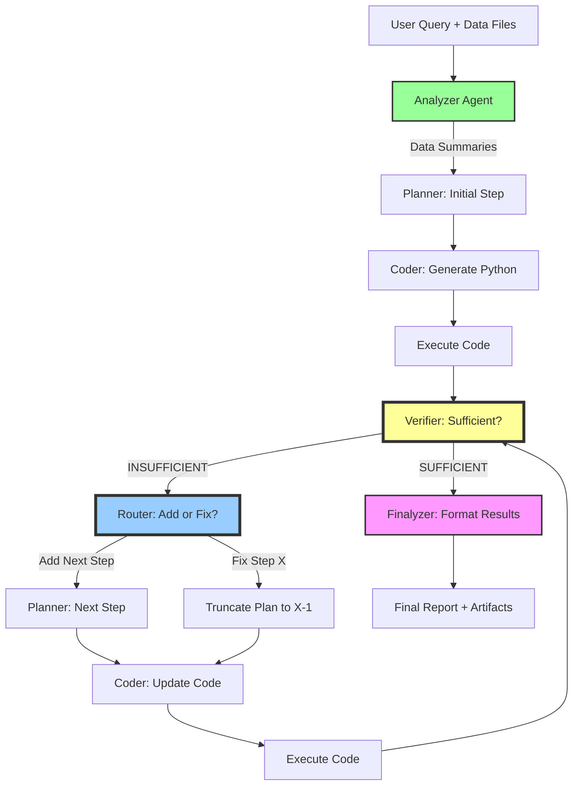
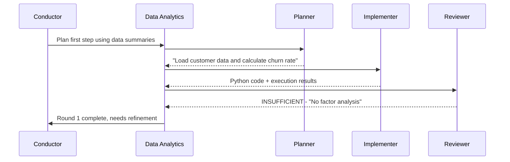

---
title: "DS-Star Integration for Data Science Workflows"
date: "2025-11-18"
status: "active"
version: "1.0.0"
references:
  - "https://research.google/blog/ds-star-a-state-of-the-art-versatile-data-science-agent/"
  - "https://arxiv.org/pdf/2509.21825"
  - "https://github.com/JulesLscx/DS-Star"
---

# DS-Star Integration — Iterative Data Science Workflows

## Overview

This document describes the integration of Google Research's **DS-Star** (Data Science - Structured Thought and Action) pattern into the Copilot Orchestrator multi-agent system. DS-Star enables state-of-the-art automated data science analysis through iterative refinement, verification loops, and artifact persistence.

**Key Innovation**: Build data science plans **sequentially** with verification after each step, rather than planning everything upfront.

## Background

### DS-Star Research Summary

DS-Star achieves SOTA performance on data science benchmarks (DABStep, KramaBench, DA-Code) by introducing:

1. **Automatic Data File Analysis**: Extract context from heterogeneous data formats (CSV, JSON, Excel, Parquet, unstructured text)
2. **Sequential Planning**: Build analysis plan one step at a time, validating intermediate results before proceeding
3. **LLM-Based Verification**: Judge evaluates whether current plan is sufficient to answer the business question
4. **Intelligent Routing**: Decide whether to add next step or fix errors in current step
5. **Complete Artifact Persistence**: Save all prompts, code, results, and metadata for reproducibility

### Performance Metrics

| Benchmark | Previous SOTA | DS-Star | Improvement |
|-----------|---------------|---------|-------------|
| DABStep (Hard) | 41.0% | 45.2% | +10.2% |
| KramaBench | 39.8% | 44.7% | +12.3% |
| DA-Code | 37.0% | 38.5% | +4.1% |

**Key Insight**: Hard multi-file tasks show the greatest improvement (average 5.6 refinement rounds vs 3.0 for easy tasks).

---

## Architecture Mapping

### DS-Star Agent Pipeline



### Copilot Orchestrator Mapping

| DS-Star Agent | Copilot Agent | Implementation Status |
|---------------|---------------|----------------------|
| **Analyzer** | Data Analytics | ✅ Enhanced with auto-analysis workflow |
| **Planner** | Planner | ⚠️ Needs sequential mode (currently plans all steps upfront) |
| **Coder** | Implementer | ✅ Existing TDD workflow compatible |
| **Verifier** | Reviewer | ✅ Enhanced with SUFFICIENT/INSUFFICIENT/BLOCKED verdicts |
| **Router** | Conductor | ✅ Enhanced with routing logic |
| **Debugger** | Implementer | ✅ Covered by TDD loop (failing test → fix → passing test) |
| **Finalyzer** | Docs | ✅ Enhanced to format data science deliverables |

---

## Workflow Implementation

### Phase 1: Data File Analysis

**Responsible Agent**: Data Analytics

**Process**:
1. Accept business question + data directory from Conductor
2. Auto-analyze all files (CSV, JSON, Excel, Parquet, databases)
3. Generate structured summaries for each file:
   - Schema (columns, types, nullability)
   - Sample rows (first 5-10)
   - Statistics (row count, null rates, unique values, ranges)
   - Data quality indicators (completeness, anomalies)
4. Save summaries to `plans/data-analysis/{session-id}/data_descriptions/`

**Artifact Example**: `customers.csv.summary.md`
```markdown
## File: customers.csv
**Path**: `/data/customers.csv`
**Format**: CSV
**Rows**: 15,234
**Columns**: 7

### Schema
| Column | Type | Nulls | Unique | Range/Sample |
|--------|------|-------|--------|--------------|
| id | int64 | 0% | 15,234 | 1-15234 |
| age | int64 | 2.3% | 67 | 18-85 |
| region | string | 0% | 4 | ["North", "South", "East", "West"] |
| activity_score | float64 | 5.1% | 10,234 | 0.0-100.0 |
| churned | bool | 0% | 2 | [True, False] |

### Data Quality
- **Completeness**: 96.3% (some nulls in age, activity_score)
- **Uniqueness**: High ID uniqueness (100%)
- **Anomalies**: 12 rows with age > 100 (potential data errors)
```

**Handoff to Conductor**: Data analysis complete, ready for planning phase.

---

### Phase 2: Iterative Planning & Verification

**Orchestration Pattern**: Conductor coordinates handoffs between Data Analytics, Planner, Implementer, and Reviewer

#### Round 1: Initial Step



**Artifacts**:
- `001_planner_init/prompt.md` - Business question + data summaries
- `001_planner_init/result.txt` - "Load customer data and calculate churn rate"
- `002_implementer/code.py` - Python analysis script
- `002_implementer/result.txt` - "Overall churn: 12.3%"
- `003_reviewer/result.txt` - "INSUFFICIENT - Missing factor analysis"
- `pipeline_state.json` - Updated with round 1 status

#### Round 2-N: Refinement Loop

**Routing Logic**:
```python
if verification == "SUFFICIENT":
    proceed_to_finalization()
elif verification == "INSUFFICIENT":
    routing_decision = route_next_action()
    if "Add next step" in routing_decision:
        plan.append(plan_next_step())
    elif "Step X is wrong" in routing_decision:
        plan = plan[:X-1]  # Truncate and retry
    regenerate_code_with_updated_plan()
elif verification == "BLOCKED":
    escalate_to_conductor(issue)
```

**Guardrails**:
- Maximum 10 refinement rounds per session
- Escalate to Conductor if 5 consecutive INSUFFICIENT verdicts
- Auto-debug enabled: max 3 code fix attempts per step

---

### Phase 3: Finalization

**Responsible Agent**: Docs (with Data Analytics review)

**Process**:
1. Take final code + results from verification-approved step
2. Format findings into structured deliverable:
   - **Executive Summary**: Key insights in 3-5 bullet points
   - **Methodology**: Data sources, transformations, statistical methods
   - **Results**: Tables, visualizations, statistical evidence
   - **Recommendations**: Actionable next steps with confidence levels
   - **Reproducibility**: Instructions to re-run analysis
3. Save to `plans/data-analysis/{session-id}/final_output/analysis-report.md`
4. Generate visualizations (charts, diagrams) in `final_output/visualizations/`

**Example Deliverable Structure**:
```markdown
# Customer Churn Analysis - Q4 2024

## Executive Summary
- Overall churn rate: 12.3% (1,873 of 15,234 customers)
- **Key drivers** (statistically significant, p<0.001):
  - Low activity score: 31% churn (vs 8% baseline)
  - Age 18-25: 22% churn (vs 10% baseline)
  - Region: No significant effect (p=0.45)
- **Recommendation**: Implement engagement campaigns for low-activity users

## Methodology
**Data Sources**:
- `customers.csv` (15,234 rows, 7 columns)
- `transactions.json` (89,421 transactions)

**Analysis Steps**:
1. Data loading and churn rate calculation
2. Segmentation analysis by demographics and behavior
3. Chi-square tests and correlation analysis
4. Feature importance via logistic regression

**Statistical Tests**:
- Chi-square: Activity level (χ²=247.3, p<0.001), Age group (χ²=12.4, p=0.03)
- Logistic regression R²: 0.34

## Results
[Charts and tables here]

## Reproducibility
To re-run this analysis:
1. Place data files in `data/` directory
2. Run: `python plans/data-analysis/20251118_143022_a3f9b2/final_output/final_analysis.py`
3. Results saved to `output/churn_analysis_results.json`
```

**Handoff to Conductor**: Analysis complete with deliverables.

---

## Artifact Persistence

### Directory Structure

```
plans/data-analysis/
  20251118_143022_a3f9b2/          # Session ID: timestamp + random hash
    steps/
      001_analyzer_customers/
        prompt.md                    # "Analyze customers.csv"
        code.py                      # Pandas analysis script
        result.txt                   # Schema + statistics
        metadata.json                # {"timestamp": "...", "step_type": "analyzer"}
      002_analyzer_transactions/
        prompt.md
        code.py
        result.txt
        metadata.json
      003_planner_init/
        prompt.md                    # Business question + data summaries
        result.txt                   # "Load customer data and calculate churn rate"
        metadata.json
      004_implementer/
        prompt.md                    # Plan step + data context
        code.py                      # Python analysis code
        result.txt                   # "Overall churn: 12.3%"
        metadata.json
      005_reviewer/
        prompt.md                    # Code + results + acceptance criteria
        result.txt                   # "INSUFFICIENT - No factor analysis"
        metadata.json
      006_planner_next/
        prompt.md
        result.txt                   # "Analyze churn by demographics and usage"
        metadata.json
      007_implementer/
        ...
      008_reviewer/
        result.txt                   # "INSUFFICIENT - No statistical significance"
      ...
      015_reviewer/
        result.txt                   # "SUFFICIENT"

    data_descriptions/
      customers.csv.summary.md       # Auto-generated schema + stats
      transactions.json.summary.md

    pipeline_state.json              # Current step, plan history, verification status

    final_output/
      analysis-report.md             # Formatted deliverable
      final_analysis.py              # Final verified code
      visualizations/
        churn_by_segment.png
        correlation_matrix.png

    logs/
      execution.log                  # All stdout/stderr
      pipeline.log                   # Workflow events
```

### State Tracking (pipeline_state.json)

```json
{
  "session_id": "20251118_143022_a3f9b2",
  "query": "What factors drive customer churn in Q4 2024?",
  "current_step": 15,
  "current_round": 3,
  "status": "completed",
  "completed_steps": [
    "001_analyzer_customers",
    "002_analyzer_transactions",
    "003_planner_init",
    "004_implementer",
    "005_reviewer",
    "006_planner_next",
    "007_implementer",
    "008_reviewer",
    "009_planner_next",
    "010_implementer",
    "011_reviewer"
  ],
  "plan": [
    "Load customer data and calculate churn rate",
    "Analyze churn by demographics and usage",
    "Statistical testing and correlation analysis"
  ],
  "data_descriptions": {
    "customers.csv": "/plans/data-analysis/20251118_143022_a3f9b2/data_descriptions/customers.csv.summary.md",
    "transactions.json": "/plans/data-analysis/20251118_143022_a3f9b2/data_descriptions/transactions.json.summary.md"
  },
  "verification_history": [
    {
      "round": 1,
      "step": "004_implementer",
      "verdict": "INSUFFICIENT",
      "reason": "No factor analysis, only overall churn rate calculated"
    },
    {
      "round": 2,
      "step": "007_implementer",
      "verdict": "INSUFFICIENT",
      "reason": "Segmentation done but no statistical significance testing"
    },
    {
      "round": 3,
      "step": "010_implementer",
      "verdict": "SUFFICIENT",
      "reason": "Statistical tests performed, key drivers identified with confidence levels"
    }
  ],
  "final_output": {
    "report": "/plans/data-analysis/20251118_143022_a3f9b2/final_output/analysis-report.md",
    "code": "/plans/data-analysis/20251118_143022_a3f9b2/final_output/final_analysis.py"
  },
  "created_at": "2025-11-18T14:30:22Z",
  "completed_at": "2025-11-18T14:47:15Z",
  "duration_minutes": 16.9
}
```

---

## Resume Capability

### Scenario: Session Interrupted at Round 2

**State Before Interruption**:
- Round 1: INSUFFICIENT (no factor analysis)
- Round 2: Implementer generated code, **not yet reviewed**

**Resume Command**:
```
@conductor Resume data science analysis session 20251118_143022_a3f9b2
```

**Resume Process**:
1. Conductor loads `pipeline_state.json`
2. Identifies `current_step: 7` (implementer)
3. Retrieves code from `007_implementer/code.py`
4. Retrieves results from `007_implementer/result.txt`
5. **Continues from next step**: Invoke `#runSubagent reviewer` to verify step 7
6. Based on verdict, continues refinement loop

**Benefits**:
- No need to re-analyze data files
- No need to regenerate previous code
- Continues exactly where interrupted

---

## Integration with Existing Workflows

### Conductor Enhancements

**File Modified**: `instructions/workflows/conductor.instructions.md` (v2.0.0)

**New Capabilities**:
- **Automatic Data Science Query Detection**: Pattern matching for analytical requests
- **Detection Triggers**: Multi-file analysis, statistical keywords, open-ended questions, exploratory analysis, multi-step workflows
- **Smart Routing**: Automatically invokes Data Analytics with DS-Star workflow enabled
- **Guardrails**: Monitors refinement rounds (max 10), escalates BLOCKED status, tracks session duration
- **Example Decision Matrix**: Clear guidance on when to use DS-Star vs standard workflow

**Detection Keywords**:
- Statistical: analyze, correlation, significance, predict, model, trends, churn, regression, clustering
- Data formats: CSV, JSON, Excel, Parquet, databases
- Analytical patterns: "What factors...", "Why does...", "Explore relationship..."

**Routing Pattern**:
```
User Query → Conductor (detects data science pattern)
           ↓
           Data Analytics (DS-Star workflow enabled)
           ↓
           Automatic: Planner → Implementer → Reviewer loop
           ↓
           Conductor (receives deliverables, presents to user)
```

**Key Distinction**:
- **Build/modify systems** → Standard Planning → Implementation workflow
- **Answer questions using data** → DS-Star iterative analysis workflow

**Impact**: Users can simply ask data science questions to `@conductor` without explicitly requesting DS-Star workflow. The conductor intelligently routes based on query patterns.

### Routing Decision Matrix

| User Request | Route To | Reason |
|--------------|----------|--------|
| "Analyze customer churn in Q4 data" | Data Analytics (DS-Star) | Statistical analysis question |
| "Build a churn prediction API" | Standard Workflow | Building a system |
| "What drives sales in different regions?" | Data Analytics (DS-Star) | Open-ended analytical question |
| "Fix bug in sales dashboard" | Standard Workflow | Code fix |
| "Explore correlations in transaction data" | Data Analytics (DS-Star) | Exploratory analysis |
| "Add new metric to dashboard" | Standard Workflow | Feature development |
| "Why did conversions drop last month?" | Data Analytics (DS-Star) | Root cause analysis |
| "Refactor ETL pipeline code" | Standard Workflow | Code refactoring |

### Troubleshooting

| Issue | Symptom | Resolution |
|-------|---------|------------|
| **Infinite Loop** | `DS-Star Round` > 10 | Conductor stops session. Check `pipeline_state.json` for repeating verdicts. Manually guide next step. |
| **Missing Artifacts** | Reviewer complains of "No metadata" | Ensure Data Analytics agent is using `v2.1.0` instructions. Run `validate-copilot-assets.ps1`. |
| **Resume Failure** | "Cannot find pipeline_state.json" | Verify session ID in `plans/data-analysis/`. If missing, restart analysis. |
| **BLOCKED Verdict** | Analysis halts early | Check `verdict.md` for specific blocker (e.g., "PII detected"). Escalate to Security agent. |

### Planner Enhancements

**Sequential Mode** (new capability):
- When invoked by Data Analytics in DS-Star workflow:
  - Plan **one step at a time** instead of complete plan upfront
  - Use current plan history + last results to determine next step
  - Support plan truncation (remove steps after error point)

**Prompting Pattern**:
```
Initial Step:
  "Given data summaries and business question, what is the FIRST analysis step?"

Next Step (after INSUFFICIENT):
  "Current plan: [step 1, step 2]. Last result: [output]. What is the NEXT step?"

Fix Step (after routing decision "Step 2 is wrong!"):
  "Truncate plan to [step 1]. Generate corrected step 2."
```

### Reviewer Enhancements

**Verification Verdicts** (standardized):
- **SUFFICIENT**: Analysis fully answers business question with adequate evidence
- **INSUFFICIENT**: Missing insights, rigor, or coverage (specify what's missing)
- **BLOCKED**: Cannot proceed due to data quality, privacy, or technical issue

**Evaluation Criteria**:
1. **Completeness**: All aspects of question addressed?
2. **Correctness**: Calculations, aggregations, joins accurate?
3. **Confidence**: Sample size adequate? Assumptions validated?
4. **Clarity**: Can stakeholders act on insights?

**Verdict Format**:
```
INSUFFICIENT - Missing statistical significance testing for demographic segments
```

### Implementer Compatibility

**Existing TDD Loop** works seamlessly:
1. Data Analytics provides analysis step + data context
2. Implementer generates Python/SQL code
3. Implementer runs code (captures output)
4. If execution fails → auto-debug loop (max 3 attempts)
5. Returns code + results to Data Analytics
6. Data Analytics invokes Reviewer for verification

**No changes required** - DS-Star workflow orchestrates existing capabilities.

---

## Usage Examples

### Example 1: Simple Analysis (1 Round)

**Query**: "What is the average order value by region?"

**Workflow**:
1. Analyzer: Summarize `orders.csv`
2. Planner: "Calculate average order value grouped by region"
3. Implementer: Generate + execute Pandas code
4. Reviewer: **SUFFICIENT** (simple aggregation, no deeper insights needed)
5. Finalyzer: Format results table

**Rounds**: 1
**Duration**: ~2 minutes

### Example 2: Moderate Analysis (3 Rounds)

**Query**: "What factors drive customer churn in Q4 2024?"

**Workflow**:
- Round 1: Calculate overall churn → **INSUFFICIENT** (no factors)
- Round 2: Segment by demographics → **INSUFFICIENT** (no significance)
- Round 3: Statistical testing → **SUFFICIENT**

**Rounds**: 3
**Duration**: ~8 minutes

### Example 3: Complex Analysis (6 Rounds)

**Query**: "Build a predictive model for customer lifetime value using transaction history and demographics"

**Workflow**:
- Round 1: Exploratory data analysis → INSUFFICIENT
- Round 2: Feature engineering → INSUFFICIENT
- Round 3: Model training (linear regression) → INSUFFICIENT (low R²)
- Round 4: **Step 3 is wrong!** Truncate, try random forest → INSUFFICIENT (overfitting)
- Round 5: Hyperparameter tuning + cross-validation → INSUFFICIENT (need feature importance)
- Round 6: Add SHAP values for interpretability → **SUFFICIENT**

**Rounds**: 6
**Duration**: ~20 minutes

---

## Success Metrics

### Performance Targets (4-Week Pilot)

| Metric | Target | How to Measure |
|--------|--------|----------------|
| **Adoption** | 10+ DS-Star sessions | Count sessions in `plans/data-analysis/` |
| **Completion Rate** | ≥80% reach SUFFICIENT | `verification_history` in state files |
| **Avg Rounds (Easy)** | ≤3 rounds | Questions with single data source |
| **Avg Rounds (Hard)** | ≤6 rounds | Multi-file or open-ended questions |
| **Resume Success** | 100% resume without errors | Test interruption scenarios |
| **Artifact Quality** | All sessions have complete artifacts | Validate with `validate-copilot-assets.ps1` |

### Quality Indicators

- **INSUFFICIENT → SUFFICIENT** progression shows learning
- **No infinite loops** (all sessions terminate within 10 rounds)
- **Reproducibility**: 100% of sessions can re-run from artifacts
- **Statistical rigor**: 90%+ of SUFFICIENT verdicts include significance tests when appropriate

---

## Validation & Tooling

### Validation Script Enhancement

**Addition to `scripts/validate-copilot-assets.ps1`**:

```powershell
# Section 6: Validate DS-Star data analysis artifacts
$dataAnalysisSessions = Get-ChildItem -Path "plans/data-analysis" -Directory -ErrorAction SilentlyContinue

foreach ($session in $dataAnalysisSessions) {
    $stateFile = Join-Path $session.FullName "pipeline_state.json"

    if (-not (Test-Path $stateFile)) {
        Write-Warning "Missing pipeline_state.json in $($session.Name)"
        continue
    }

    $state = Get-Content $stateFile | ConvertFrom-Json

    # Check for infinite loops
    if ($state.current_round -gt 10) {
        Write-Warning "Session $($session.Name) exceeded max rounds: $($state.current_round)"
    }

    # Validate artifact completeness
    foreach ($step in $state.completed_steps) {
        $stepDir = Join-Path $session.FullName "steps\$step"
        if (-not (Test-Path "$stepDir\metadata.json")) {
            Write-Warning "Missing metadata.json in step $step"
        }
    }

    # Check final output if completed
    if ($state.status -eq "completed") {
        $finalReport = Join-Path $session.FullName "final_output\analysis-report.md"
        if (-not (Test-Path $finalReport)) {
            Write-Warning "Completed session $($session.Name) missing final report"
        }
    }
}
```

### Analytics Script Enhancement

`scripts/analyze-sessions.ps1` now ships with a DS-Star aware telemetry pipeline:

- New `-DSStarPath` parameter lets you point the analytics run at fixture data or sandbox sessions without copying files into `plans/data-analysis/`.
- DS-Star adoption metrics (completion rate, average rounds/steps/duration, verdict mix, resume-ready in-progress sessions) render in both the console summary and a dedicated section inside `docs/dashboards/workflow-metrics.md`.
- Latest session highlights are auto-generated from `pipeline_state.json` timestamps so conductors can inspect recent verdicts at a glance.
- When no DS-Star sessions exist, the script prints prescriptive guidance instead of silently emitting blanks.

```powershell
$dsStarSessions = Get-DsStarSessions -Path $resolvedDsStarPath
Update-DsStarMetricsSummary -Sessions $dsStarSessions -SourcePath $resolvedDsStarPath

Write-DsStarConsoleSummary

$report = @"
...
---
$(Get-DsStarMarkdownSection)
---
"@
```

### Regression Fixture & Tests

- `tests/powershell/fixtures/ds-star-session/` contains a complete DS-Star run (steps, metadata, verdict logs, final output). Copy it under `plans/data-analysis/` to simulate a resume scenario or to demo router logic.
- `tests/powershell/ValidationScripts.Tests.ps1` now copies that fixture into `$TestDrive`, runs `scripts/analyze-sessions.ps1`, and asserts that the regenerated dashboard includes the DS-Star section with resume-readiness terminology.
- `docs/dashboards/workflow-metrics.md` is regenerated via the script so documentation reflects the richer telemetry (including DS-Star verdict mix and latest-session bullets).

---

## Future Enhancements

### Tier 2 Capabilities (Future Roadmap)

1. **Multi-Modal Analysis**: Support for images, PDFs, unstructured text alongside tabular data
2. **Automated Feature Engineering**: LLM suggests derived features based on domain knowledge
3. **Model Selection Agent**: Evaluate multiple algorithms and recommend best fit
4. **Incremental Learning**: Resume sessions can add new data files without re-analysis
5. **Collaborative Workflows**: Multiple users can review/edit plans in shared sessions
6. **Cost Optimization**: Cache common data summaries across sessions

### Community Contributions

- Submit DS-Star workflows to [awesome-copilot](https://github.com/github/awesome-copilot)
- Share successful verification criteria and routing patterns
- Contribute domain-specific analysis templates (finance, healthcare, e-commerce)

---

## References

- **Research Paper**: [DS-STAR: A State-of-the-Art Versatile Data Science Agent](https://arxiv.org/pdf/2509.21825)
- **Blog Post**: [Google Research DS-Star Announcement](https://research.google/blog/ds-star-a-state-of-the-art-versatile-data-science-agent/)
- **Reference Implementation**: [JulesLscx/DS-Star GitHub](https://github.com/JulesLscx/DS-Star)
- **Copilot Orchestrator**: `AGENTS.md`, `docs/workflows/orchestration-rebuild-plan.md`

---

**Document Status**: Active
**Next Review**: 2025-12-18 (after 4-week pilot)
**Owner**: Data Analytics + Conductor teams
**Feedback**: Capture learnings in `docs/operations.md` and update instruction versions
