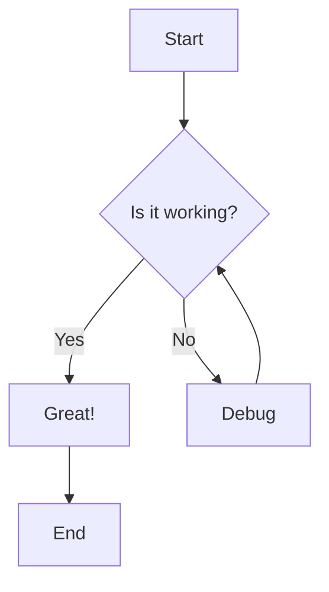
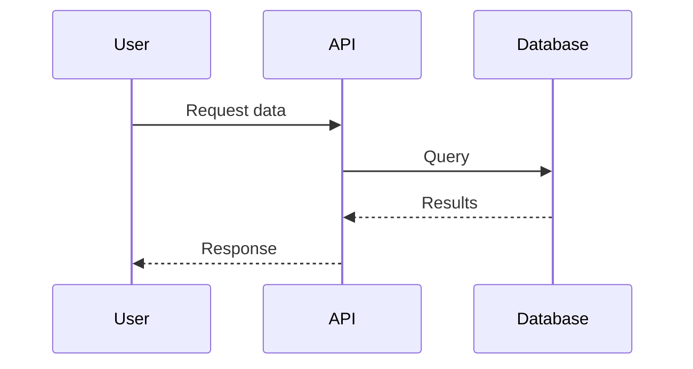
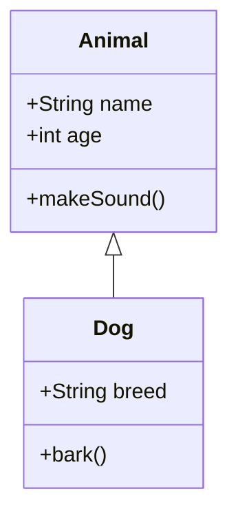
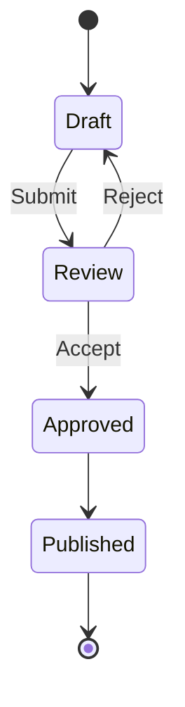
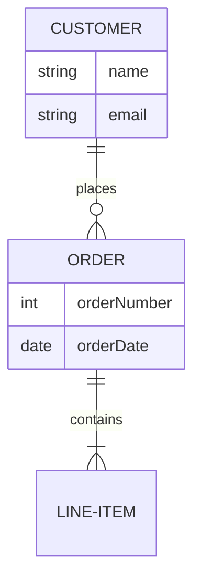
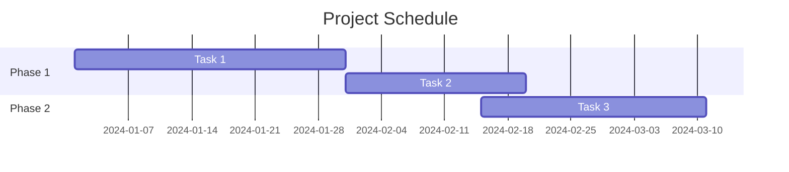
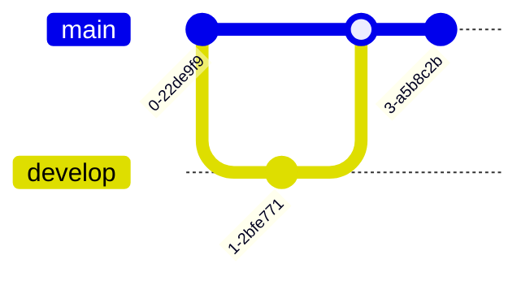
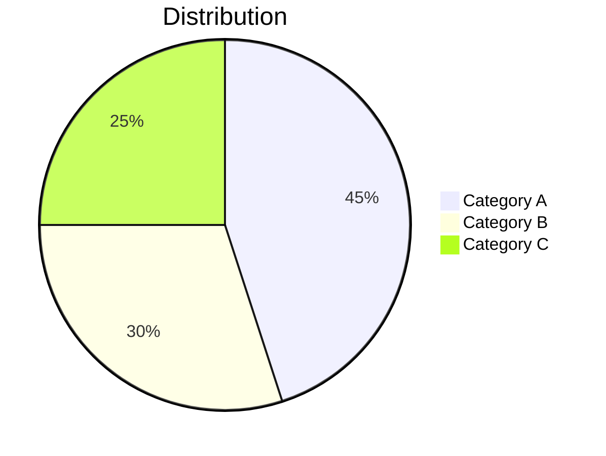

## Guiding Principles

- Write clear, concise, and well-structured documentation that serves the
  reader's needs.
- Use Markdown's simplicity to create maintainable documentation.
- Organize content with a logical hierarchy using headings.
- Make documentation scannable with visual elements like lists, tables,
  and diagrams.
- Keep language simple and accessible; write for your audience's expertise
  level.

## Document Structure

- Start with a clear title using a single level-1 heading (`#`).
- Use heading hierarchy properly: `#`, `##`, `###` for logical structure.
- Don't skip heading levels; maintain proper nesting.
- Use a table of contents for long documents (can be auto-generated).
- Place important information at the top; follow the inverted pyramid style.
- Use horizontal rules (`---`) sparingly to separate major sections.

## Headings and Formatting

- Use ATX-style headings (`#`) rather than Setext-style (`===` or `---`).
- Add a blank line before and after headings for readability.
- Use sentence case for headings rather than title case, unless it's a
  proper noun.
- Use **bold** for emphasis on key terms or important warnings.
- Use *italic* for subtle emphasis or introducing new terms.
- Use `inline code` for commands, file names, functions, and technical terms.
- Use ~~strikethrough~~ to show deprecated or outdated information.

## Lists

- Use `-` for unordered lists consistently.
- Use `1.` for ordered lists; numbering will be automatic in most renderers.
- Maintain proper indentation (2 or 4 spaces) for nested lists.
- Add blank lines between list items for complex items with multiple
  paragraphs.
- Use task lists with `- [ ]` and `- [x]` for checklists and tracking.
- Keep list items concise; break into paragraphs if needed.

## Code Blocks

- Use fenced code blocks with language identifiers for syntax highlighting:
  ````markdown
  ```python
  def hello():
      print("Hello, world!")
  ```
  ````
- Specify the correct language for proper highlighting: `javascript`,
  `python`, `bash`, `json`, `yaml`, `sql`, etc.
- Use inline code for short snippets or technical terms within text.
- Include file names or descriptions before code blocks when context is
  needed.
- Keep code examples concise and focused on the relevant parts.
- Test code examples to ensure they work as documented.

## Links and References

- Use descriptive link text instead of "click here" or bare URLs.
- Use reference-style links for cleaner text when the same URL is used
  multiple times:
  ```markdown
  [link text][reference]
  
  [reference]: https://example.com
  ```
- Use relative paths for internal documentation links.
- Use absolute URLs for external resources.
- Verify all links periodically to prevent broken links.
- Use anchor links to reference sections within the same document:
  `[jump to section](#section-heading)`.

## Images and Media

- Use alt text for all images for accessibility and context:
  ``
- Keep image files in an appropriate assets or images directory.
- Use relative paths for images stored in the repository.
- Specify image dimensions when needed using HTML: ``.
- Optimize images for web viewing to keep documentation lightweight.
- Use captions or descriptions after images when additional context is
  needed.

## Tables

- Use tables for structured data comparison or reference information.
- Align table columns for readability in the source:
  ```markdown
  | Column 1 | Column 2 | Column 3 |
  |----------|----------|----------|
  | Value 1  | Value 2  | Value 3  |
  ```
- Use alignment indicators in the separator row: `:---` (left), `:---:`
  (center), `---:` (right).
- Keep tables simple; break into multiple tables if too complex.
- Consider using lists instead of tables for simple key-value pairs.

## Mermaid Diagrams

Mermaid is a powerful tool for creating diagrams directly in Markdown using
a simple syntax. Use Mermaid for visualizing complex concepts, workflows,
and architectures.

### Flowcharts

Use flowcharts to visualize processes, decision trees, and workflows:



Common node shapes:
- `[Rectangle]` - Process or action
- `{Diamond}` - Decision point
- `([Stadium])` - Start/end
- `[[Subroutine]]` - Subprocess
- `[(Database)]` - Database
- `((Circle))` - Connection point

### Sequence Diagrams

Use sequence diagrams to show interactions between components over time:



### Class Diagrams

Use class diagrams to visualize object-oriented designs and relationships:



### State Diagrams

Use state diagrams to model state machines and lifecycle workflows:



### Entity Relationship Diagrams

Use ER diagrams to model database schemas and relationships:



### Gantt Charts

Use Gantt charts for project timelines and task dependencies:



### Git Graphs

Use git graphs to visualize branching and merging strategies:



### Pie Charts

Use pie charts for showing proportional data:



### Mermaid Best Practices

- Choose the right diagram type for your use case.
- Keep diagrams simple and focused; break complex diagrams into multiple
  smaller ones.
- Use consistent naming and styling across diagrams.
- Add titles to diagrams with `title` or descriptive text before the diagram.
- Use descriptive labels for nodes, edges, and states.
- Test diagrams in a Mermaid-compatible viewer or renderer.
- Use comments in Mermaid syntax with `%%` for documentation:
  `%% This is a comment`.
- Consider colorizing nodes for emphasis (use sparingly):
  `style A fill:#f9f,stroke:#333,stroke-width:4px`.

## Blockquotes and Callouts

- Use blockquotes (`>`) for quotations, notes, or highlighting important
  information.
- Some renderers support callouts or admonitions for tips, warnings, and
  notes:
  ```markdown
  > **Note:** This is an important note.
  
  > **Warning:** Be careful with this operation.
  ```
- Keep blockquotes concise and use them purposefully.

## File Organization

- Use clear, descriptive file names in lowercase with hyphens: `user-guide.md`.
- Organize documentation into logical directories by topic or component.
- Create an index or README in each directory to help navigation.
- Keep related documents together in the same directory.
- Use consistent file naming conventions across the documentation.

## Linting and Validation

- Use Markdown linters (markdownlint, remark-lint) to enforce consistency.
- Run link checkers to identify broken links.
- Validate Mermaid diagrams with a renderer before committing.
- Use spell checkers to catch typos and errors.
- Review rendered output to ensure formatting appears as intended.

## Accessibility

- Use descriptive alt text for images for screen readers.
- Structure documents with proper heading hierarchy for navigation.
- Avoid relying solely on color to convey meaning in diagrams.
- Use semantic HTML when Markdown's capabilities are insufficient.
- Test documentation with screen readers when possible.

## Best Practices

- Write in active voice for clarity and directness.
- Use present tense for current features and functionality.
- Be consistent with terminology throughout documentation.
- Update documentation alongside code changes.
- Version documentation appropriately for different software versions.
- Include examples to illustrate concepts and usage.
- Keep paragraphs short and focused on one idea.
- Use numbered lists for sequential steps, bullet lists for unordered items.
- Review and edit for clarity, removing unnecessary words.

## GitHub Flavored Markdown (GFM) Extensions

- Use task lists for tracking items: `- [x] Completed`, `- [ ] Pending`.
- Use table of contents with anchors for navigation in long documents.
- Use emoji when appropriate (sparingly): `:rocket:` renders as 🚀.
- Use syntax highlighting with language identifiers in code blocks.
- Reference issues and PRs with `#123` notation in GitHub repositories.
- Use HTML when Markdown limitations prevent desired formatting.
